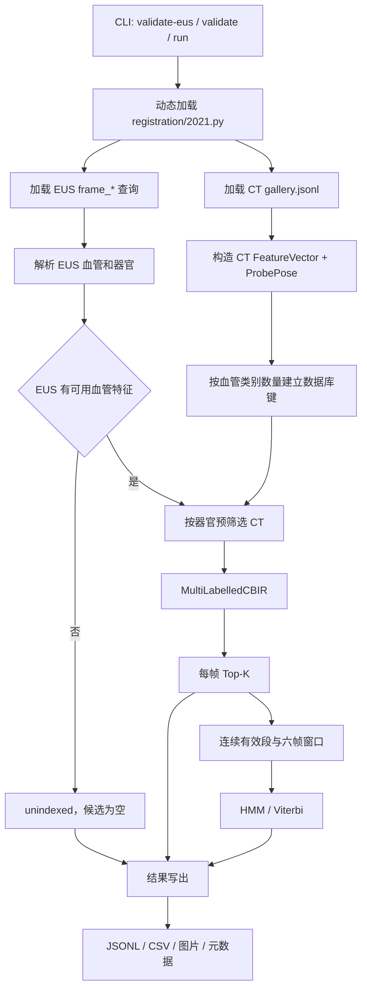
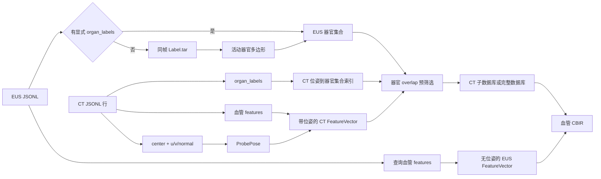
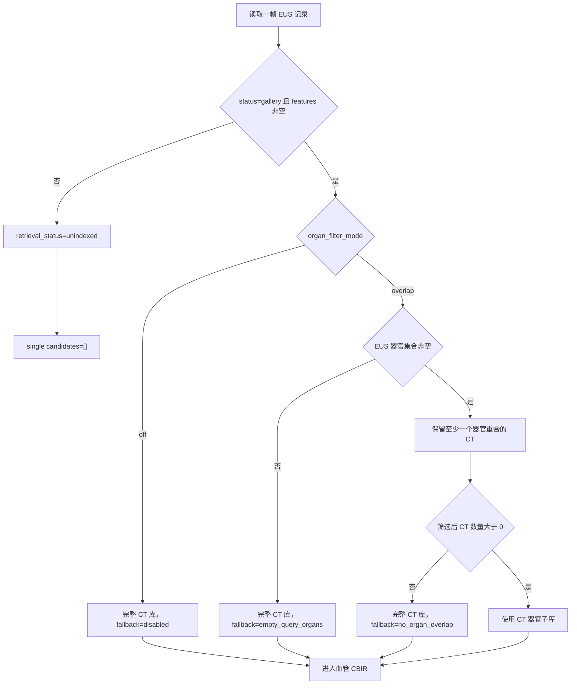
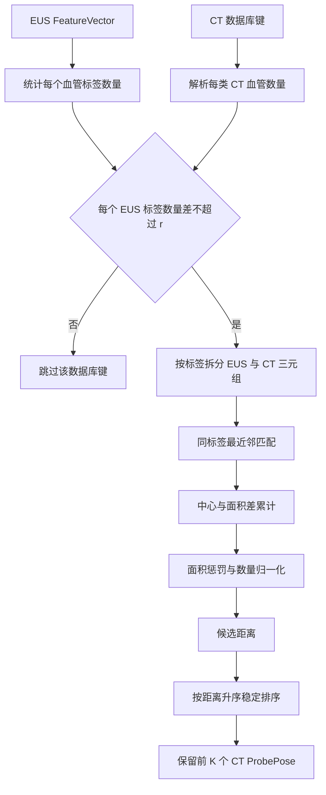
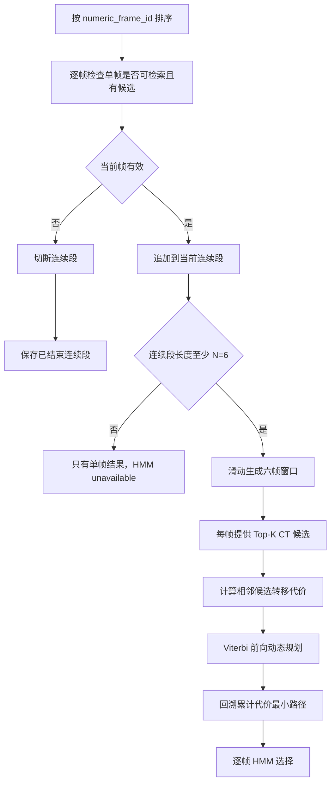
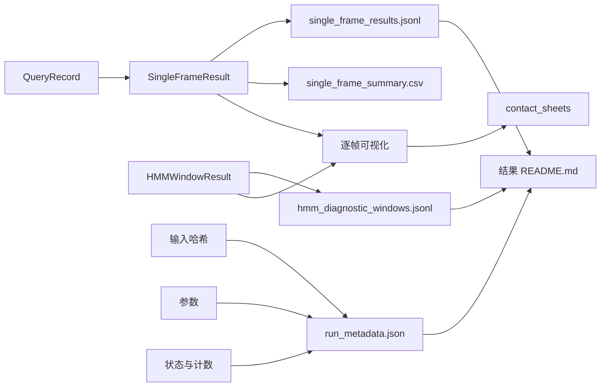

# Ramalhinho 2021 器官预筛选、血管 CBIR 与 HMM 项目详细说明

> 文档基线：2026-08-05<br>
> 项目目录：`/home/zyt/ramalhinho_2021_local_reproduction`<br>
> Python 包：`ramalhinho2021`<br>
> 远程仓库：`https://github.com/wqpw01/2021HMM`<br>
> 适用对象：算法研发、医学影像工程、论文复现、结果审计与第一次接触项目的读者

---

## 目录

1. [执行摘要](#1-执行摘要)
2. [项目目标、输入与输出](#2-项目目标输入与输出)
3. [总体架构与详细流程图](#3-总体架构与详细流程图)
4. [项目结构](#4-项目结构)
5. [输入要求与参数配置](#5-输入要求与参数配置)
6. [处理流程详解](#6-处理流程详解)
7. [数据流、特征与坐标系统](#7-数据流特征与坐标系统)
8. [输出目录与数据协议](#8-输出目录与数据协议)
9. [核心代码文件说明](#9-核心代码文件说明)
10. [安装、验证与正式运行](#10-安装验证与正式运行)
11. [调试、测试与结果核验](#11-调试测试与结果核验)
12. [性能、恢复与部署建议](#12-性能恢复与部署建议)
13. [注意事项与已知边界](#13-注意事项与已知边界)
14. [故障排查表](#14-故障排查表)
15. [复现与审计附录](#15-复现与审计附录)

---

## 1. 执行摘要

### 1.1 项目一句话说明

本项目使用已经建立好的 CT 模拟超声切面图库，对没有外部跟踪器位姿的二维
内镜超声（EUS）进行检索定位。它先判断一帧 EUS 是否具有可用血管特征，随后
利用该帧出现的器官缩小 CT 候选范围，再用多标签血管特征完成单帧内容检索；
对于连续有效帧，最后使用六帧 HMM/Viterbi 从每帧候选中选择运动更平滑的 CT
位姿路径。

主链可以记成：

```text
EUS 查询准入
  → 根据 EUS 器官预筛 CT
  → 多标签血管 CBIR 返回每帧 Top-K
  → 连续有效段切成六帧窗口
  → Viterbi 选择累计转移代价最小的 CT 位姿路径
```

这不是直接比较 EUS 灰度图和 CT 灰度图。真正参与论文式距离计算的是血管截面
的类别、二维中心位置和面积；器官标签只是检索前的上下文过滤条件。

### 1.2 正式运行结果概览

本说明中的“正式运行”指 2026-08-03 完成的器官任意重合预筛选加血管 CBIR
运行。其输入、参数和统计以交付结果中的 `run_metadata.json`、
`single_frame_results.jsonl`、`single_frame_summary.csv` 和
`hmm_diagnostic_windows.jsonl` 为准。

| 项目 | 正式值 | 含义 |
|---|---:|---|
| CT 可检索切面 | 112,749 | CT `gallery.jsonl` 中进入数据库的切面数 |
| EUS 总帧数 | 105 | 被项目发现并加载的查询帧数 |
| 单帧检索成功 | 91 | 每帧均返回完整 Top-200 |
| 单帧不可索引 | 14 | `status=unindexed` 且没有可用血管三元组 |
| 实际应用器官预筛选 | 18 | 有可用血管且有非空活动器官轮廓 |
| 空器官回退完整 CT 库 | 73 | 有血管、无器官，不因器官信息缺失丢帧 |
| HMM 六帧窗口 | 43 | 连续有效段滑动生成的窗口总数 |
| 获得 HMM 诊断选择的帧 | 88 | 至少分配到一个六帧窗口 |
| 有单帧结果但无 HMM | 3 | 所在连续有效段长度小于 6 |

为了便于自动审计，上述核心关系可写成：

```text
EUS 总帧数=105
retrieved=91
unindexed=14
diagnostic_only=88
insufficient_contiguous_valid_frames=3
HMM 窗口=43
single_candidate_count: 200×91, 0×14
```

### 1.3 四个最容易混淆的状态

| 状态 | 出现在哪一层 | 小白解释 | 当前正式运行数量 |
|---|---|---|---:|
| `retrieved` | 单帧 | EUS 有可用血管，已经得到 CT 候选 | 91 |
| `unindexed` | 单帧/HMM | EUS 没有可用血管，单帧就不能检索 | 14 |
| `diagnostic_only` | HMM | 已得到平滑候选，但没有真值证明它正确 | 88 |
| `insufficient_contiguous_valid_frames` | HMM | 有单帧结果，但连续有效段不足六帧 | 3 |

`fallback_reason` 是另一组概念。它说明器官预筛选为什么没有应用，例如
`empty_query_organs` 表示 EUS 没有器官轮廓，于是回退到完整 CT 库。回退不等于
单帧失败；正式运行中 73 个这种帧仍全部得到 Top-200。

### 1.4 最重要的事实边界

1. **器官标签不进入血管距离。** 器官只负责选择先搜索哪些 CT 切面。
2. **EUS 没有患者世界坐标。** EUS 查询 `FeatureVector` 只有血管三元组，输出的
   `ProbePose` 来自命中的 CT 候选。
3. **Top-1 不是正确答案。** 它只是当前距离最小的数据库切面。
4. **HMM 不是凭空产生定位。** 它只能在每帧已有候选之间选择更平滑的组合。
5. **当前没有真值。** 因而不能据此计算定位准确率、TRE 或临床成功率。
6. **正式运行没有提供真实时间戳。** `equal_unit_intervals` 表示使用
   `[0,1,2,3,4,5]`，不代表 1 秒一帧，也不代表任何固定帧率。
7. **`features=[]` 不一定是人工没画血管。** 有些人工血管轮廓会因裁剪后触碰
   图像边界而被质量规则跳过。

### 1.5 十四个无单帧结果帧

| 帧号 | 从 TAR 活动轮廓解析的器官 | 当前无可用血管的直接原因 |
|---|---|---|
| `frame_00003744` | 无 | 未生成可用血管特征 |
| `frame_00005310` | gallbladder | 门静脉、脾静脉触边，被跳过 |
| `frame_00006055` | 无 | 未生成可用血管特征 |
| `frame_00007952` | kidney_left、spleen | 有器官，但未生成可用血管特征 |
| `frame_00009279` | adrenal_gland_left | 有器官，但未生成可用血管特征 |
| `frame_00010420` | adrenal_gland_left | 有器官，但未生成可用血管特征 |
| `frame_00010461` | adrenal_gland_left | 有器官，但未生成可用血管特征 |
| `frame_00011477` | 无 | 未生成可用血管特征 |
| `frame_00011698` | gallbladder | 有器官，但未生成可用血管特征 |
| `frame_00016189` | 无 | 腹主动脉触边，被跳过 |
| `frame_00018247` | 无 | 未生成可用血管特征 |
| `frame_00023556` | gallbladder | 有器官，但未生成可用血管特征 |
| `frame_00030029` | gallbladder | 有器官，但未生成可用血管特征 |
| `frame_00032757` | 无 | 门静脉、下腔静脉触边，被跳过 |

其中 `frame_00005310`、`frame_00016189` 和 `frame_00032757` 的人工标注确实
包含血管。裁剪后的连通区域命中 `touches_image_edge`，所以没有转换成
`VesselTriplet`。对另外 11 帧，只能严谨地说“当前处理结果没有可用特征”，
不能从空 `features` 反推标注者一定从未画过血管。

### 1.6 三个只有单帧、没有 HMM 的帧

- `frame_00008833`：位于两个不可索引帧之间，形成长度 1 的有效段；
- `frame_00016375`；
- `frame_00016596`：后两帧形成长度 2 的有效段。

三帧各有 200 个单帧候选，只是无法组成默认 `N=6` 的 HMM 窗口。

---

## 2. 项目目标、输入与输出

### 2.1 项目解决的问题

输入是一帧或一段没有光学/电磁跟踪器位姿的二维 EUS。目标是在一个已经离线
构建好的 CT 模拟超声切面库中，找到血管结构相似且器官上下文合理的候选切面，
并读取这些 CT 切面的三维中心和朝向。

单帧模式解决：

```text
这一帧 EUS 在 CT 图库中最像哪些切面？
```

连续帧模式进一步解决：

```text
每帧都有很多相似切面时，哪一组连续候选的三维运动更平滑？
```

### 2.2 为什么需要器官信息

只使用血管时，不同解剖区域可能出现数量、面积和相对位置相似的血管截面。
EUS 如果同时显示胆囊、脾脏或左肾等结构，就可以先排除不包含这些器官的 CT
切面，再在剩余范围内比较血管。

本项目默认使用 `overlap`：EUS 与 CT 的器官集合至少有一个相同标签即可保留。
例如 EUS 为 `kidney_left+spleen`，包含左肾或包含脾脏的 CT 都会进入后续 CBIR。
这是当前代码和正式运行的事实，不应误写成“CT 必须同时包含全部 EUS 器官”。

### 2.3 输入概览

```text
输入 A：CT 检索库
  gallery/gallery.jsonl
  + 每条记录引用的 CT/边界/叠加图片

输入 B：EUS 特征根目录
  frame_*/
    *_cropped_gallery.jsonl
    *_cropped_jpg_Label.tar
    *_cropped.jpg / *_cropped_overlay.png

输入 C：算法核心
  registration/2021.py

可选输入 D：真实时间戳
  frame_id,timestamp_seconds CSV
```

CT JSONL 提供两类核心信息：

- 血管 `features`，用于 CBIR；
- `center_world` 和 `u/v/normal`，用于重建 CT 切面位姿。

EUS JSONL 提供查询血管特征。器官标签优先使用 EUS JSONL 中显式
`organ_labels`；字段不存在时，项目读取同帧人工标注 TAR 的活动器官多边形。

### 2.4 输出概览

一次完整运行输出：

| 输出 | 解决的问题 |
|---|---|
| `single_frame_results.jsonl` | 每帧有哪些 Top-K CT 候选及距离 |
| `single_frame_summary.csv` | 用表格快速查看状态、Top-1、候选数和器官过滤 |
| `hmm_diagnostic_windows.jsonl` | 每个六帧窗口选择了哪条路径及转移代价 |
| `run_metadata.json` | 输入哈希、代码哈希、参数、计数和运行模式 |
| `visualizations/` | 逐帧 EUS、单帧 Top-1 和 HMM 选择对比图 |
| `contact_sheets/` | 多帧缩略汇总页 |
| `README.md` | 该次结果包的简短入口说明 |

### 2.5 本项目做什么

1. 验证 `gallery.jsonl` 的血管、位姿轴和器官字段；
2. 把 CT 行转换为带 `ProbePose` 的 `FeatureVector`；
3. 加载并排序 EUS 帧；
4. 从 JSONL 或人工 TAR 解析 EUS 器官；
5. 判断 EUS 是否具有可用血管特征；
6. 按器官预筛选 CT；
7. 调用 `2021.py` 的多标签血管 CBIR；
8. 生成连续有效段和六帧窗口；
9. 调用 Viterbi 得到诊断性平滑路径；
10. 输出结构化结果、图片和可追溯元数据。

### 2.6 本项目不做什么

- 不重新建立 CT 图库；
- 不从原始 EUS 灰度图自动分割血管；
- 不训练器官或血管分割模型；
- 不自动把 CT 与 EUS 配准到同一个真实患者坐标；
- 不把器官加入 `2021.py` 的血管距离公式；
- 不从 EUS 文件推断真实探头位置；
- 不在没有真值时计算可靠 TRE；
- 不证明 Top-1 或 HMM 路径就是正确解剖位置；
- 不提供检索中途断点恢复；
- 不替代医生或研究人员的医学判断。

### 2.7 论文、脚本、本项目和正式运行的区别

| 层级 | 负责内容 | 阅读时注意 |
|---|---|---|
| 论文 | 多标签 CBIR 和 HMM 方法 | 论文实验条件不自动等于本次数据条件 |
| `2021.py` | 论文对象和算法的本地复现实现 | 个别公式实现细节应以代码为准 |
| `ramalhinho2021` 包 | 输入适配、器官过滤、窗口、输出 | 这是本项目新增的工程层 |
| 正式运行 | 一组确定输入、参数和输出 | 结果只对该次输入与版本成立 |

---

## 3. 总体架构与详细流程图

本章先用图展示全局关系，再在第 5 至第 8 章逐字段解释。所有节点文字均加引号，
以兼容 Mermaid 9.1.2。若阅读器不支持 Mermaid，请直接阅读每图后的纯文本说明。

### 3.1 端到端架构图



不支持 Mermaid 时，可按以下顺序理解：

```text
命令行
  → 同时加载算法、CT 图库和 EUS
  → EUS 无血管则直接记为 unindexed
  → EUS 有血管则先按器官缩小 CT 范围
  → 计算血管距离并保留 Top-K
  → 连续有效帧运行 HMM
  → 写结构化结果和图片
```

### 3.2 CT 与 EUS 双输入数据流



纯文本数据关系：

```text
CT 侧 = 血管特征 + 器官上下文 + 已知三维切面位姿
EUS 侧 = 血管特征 + 器官上下文 + 未知真实三维位姿
两侧先在器官集合处筛选，再在血管 FeatureVector 处比较
```

### 3.3 EUS 准入与 CT 器官筛选状态图



这里有两个不同判断：

```text
判断 1 检查 EUS：有没有可用于血管检索的查询 FeatureVector？
判断 2 筛选 CT：哪些 CT 切面的 organ_labels 与 EUS 有交集？
```

器官信息不能让一个 `features=[]` 的 EUS 变得可检索。它也不能替代血管距离
进行最终排序。

### 3.4 多标签单帧 CBIR 流程



小白版：先排除血管数量差得太多的 CT 组合；对剩下的 CT，同类血管只和同类
血管比较；距离越小越相似；最后取最小的前 K 个。

### 3.5 连续段、六帧窗口和 Viterbi



窗口不是把任意六个帧号放在一起。项目只看加载后按数字排序的查询序列；一帧
`unindexed` 或零候选会结束当前连续有效段。长度小于六的段保留单帧结果，但
不会调用 HMM。

### 3.6 输出持久化流程



纯文本输出关系：

```text
每帧对象 → 单帧 JSONL + 摘要 CSV + 图片
每个窗口对象 → HMM 窗口 JSONL + 图片中的 HMM 选择
输入/参数/统计 → run_metadata.json
所有核心文件 → 结果 README 入口
```

### 3.7 为什么既要流程图又要数据协议

流程图回答“先做什么、后做什么”；数据协议回答“每一步具体拿什么字段、产生
什么字段”。只看流程图会不知道 `organ` 与 `organ_labels` 的区别，只看 JSON
又不容易理解 EUS 准入为什么发生在 CT 器官筛选之前。因此第 3 章和第 5 至
第 8 章需要结合阅读。

---

## 4. 项目结构

### 4.1 仓库目录树

```text
ramalhinho_2021_local_reproduction/
├── README.md
├── HMM文档.md
├── pyproject.toml
├── environment.yml
├── run_reproduction.py
├── registration/
│   └── 2021.py
├── examples/
│   └── timestamps.example.csv
├── src/ramalhinho2021/
│   ├── __init__.py
│   ├── __main__.py
│   ├── cli.py
│   ├── inputs.py
│   ├── organs.py
│   ├── pipeline.py
│   └── outputs.py
├── tests/
│   ├── test_cli.py
│   ├── test_documentation.py
│   ├── test_inputs.py
│   ├── test_organs.py
│   ├── test_outputs.py
│   ├── test_pipeline.py
│   └── test_registration_defaults.py
└── docs/superpowers/
    ├── specs/
    └── plans/
```

### 4.2 两种程序入口

```text
python run_reproduction.py ...
  → 把项目 src/ 加入 Python 模块搜索路径
  → 导入 ramalhinho2021.cli.main

python -m ramalhinho2021 ...
  → Python 执行包内 __main__.py
  → 导入 ramalhinho2021.cli.main
```

两种入口最终进入同一个 `cli.main()`，所以命令参数和行为相同。

### 4.3 模块边界

| 模块 | 只负责什么 | 不负责什么 |
|---|---|---|
| `cli.py` | 参数、调用顺序、统计、错误出口 | 不计算血管距离 |
| `inputs.py` | JSONL/TAR/CSV 到项目对象 | 不运行 HMM |
| `organs.py` | 器官词表与 TAR 活动轮廓 | 不解析血管距离 |
| `pipeline.py` | 器官过滤、单帧、窗口、HMM | 不负责图片布局细节 |
| `outputs.py` | JSONL、CSV、图片和元数据 | 不改变候选排序 |
| `2021.py` | 血管对象、CBIR、HMM/Viterbi | 不知道本项目输出目录 |

### 4.4 文档实现基线与维护约定

项目远端仓库为：

```text
origin = https://github.com/wqpw01/2021HMM
```

`HMM文档.md` 是仓库内唯一维护源，README 和文档测试均指向该文件。桌面交付的
Markdown 由它复制，HTML 由它转换生成，不维护第二套独立正文。修改算法、字段或
默认参数后，应先更新仓库源文档并运行测试，再重新生成两种桌面格式。

### 4.5 项目依赖

项目属于科学计算和医学图像复现任务，默认使用 Mamba。主要运行依赖是 Python、
NumPy 和 Pillow；测试使用 pytest。`registration/2021.py` 通过 NumPy 实现本次
实际调用的特征、距离和动态规划核心。

### 4.6 数据不存入 Git

CT 图库约十万级记录，EUS 输入包含临床图像和人工标注，正式结果也包含逐帧
可视化。这些大文件不提交到代码仓库。仓库只维护代码、环境、示例时间戳、测试
和说明文档；真实路径通过命令参数传入。

---

## 5. 输入要求与参数配置

### 5.1 输入之间的依赖关系

本项目不接受“只有一张 EUS 图片”直接运行。完成正式检索至少需要三项：

```text
可加载的 registration/2021.py
  + 已建好的 CT gallery.jsonl
  + 已提取血管特征的 EUS 帧目录
```

`run`、`validate` 和 `validate-eus` 使用正式输入契约：CT/EUS 局部平面必须为
100 mm × 100 mm，EUS 必须声明 `pose_coordinate_system="synthetic_2d_10cm_crop"`
和 `patient_world_pose=false`。这些输入由上游项目提供；本项目不会生成
`*_cropped_gallery.jsonl`、重采样 CT 或调用 TotalSegmentator。

器官过滤默认开启，所以 CT 记录必须有 `organ_labels`，EUS 必须能从 JSONL 或同帧
TAR 获得器官集合。只有显式使用 `--organ-filter-mode off` 时，器官字段可以不提供。

### 5.2 CT 图库目录

典型路径：

```text
<ct-case>/
└── gallery/
    ├── gallery.jsonl
    ├── ct/
    │   └── <slice_id>.png
    ├── boundary_only/
    │   └── <slice_id>.png
    ├── ct_overlay/
    │   └── <slice_id>.png
    └── organ_vessel_boundary/
        └── <slice_id>.png
```

本项目只把 `gallery.jsonl` 中可检索的切面加载为数据库。建库阶段的
`unindexed`、`rejected` 或 `excluded_fov` 记录不能拼入该文件，否则它们缺少
血管特征或不满足图库质量协议。

### 5.3 CT JSONL 关键字段与条件要求

`gallery.jsonl` 一行代表一张 CT 模拟超声切面。关键字段如下：

| 字段 | 类型 | 何时必需 | 是否参与算法 | 作用 |
|---|---|---|:---:|---|
| `frame_id` | string | CT 加载时可选 | 否 | 病例/帧来源审计标识 |
| `slice_id` | string | 写正式结果时必需 | 输出关联 | CT 切面唯一名称 |
| `status` | string | 始终 | 是 | 必须为 `gallery` |
| `organ` | string | 可选 | 否 | 复制到候选结果，表示切面采样来源 |
| `organ_labels` | list[string] | `overlap` 模式必需；`off` 模式可缺失 | 是 | 切面真正包含的器官，用于预筛选 |
| `center_world` | 3 floats | 始终 | 是 | CT 世界坐标中的切面中心，mm |
| `u_axis_world` | 3 floats | 始终 | 是 | 切面局部 u 轴 |
| `v_axis_world` | 3 floats | 始终 | 是 | 切面局部 v 轴 |
| `normal_world` | 3 floats | 始终 | 是 | 与 u/v 组成旋转矩阵并参与欧拉角构造 |
| `features` | list[object] | 始终且非空 | 是 | 动脉/静脉截面三元组 |
| `width_mm`、`length_mm` | number | 正式运行始终 | 预检 | 必须为 100 mm × 100 mm |
| `pixel_spacing_mm` | [number, number] | 正式运行始终 | 预检 | 二维平面的有效像素间距 |
| `ct_png` | string | 可选 | 否 | 复制到候选 JSON，当前三联图不读取 |
| `boundary_only_png` | string | 可选 | 否 | 复制到候选 JSON，当前三联图不读取 |
| `ct_overlay_png` | string | 可选 | 可视化 | 复制到候选 JSON，并由三联图读取；缺失时显示占位信息 |
| `organ_vessel_boundary_png` | string | 可选 | 否 | 本项目当前完全未使用，不进入候选 JSON |

`organ` 与 `organ_labels` 不能混用。`organ=liver` 只说明这个切面最初从肝表面
采样，不保证当前方形中一定显示肝，也不列出切面中的其他器官。只有
`organ_labels` 表示经过求交后实际包含的器官集合。

### 5.4 CT JSONL 示例

```json
{
  "frame_id": "case_2",
  "slice_id": "liver-000123-y-17",
  "status": "gallery",
  "organ": "liver",
  "organ_labels": ["liver", "stomach"],
  "center_world": [12.3, -45.6, 78.9],
  "u_axis_world": [1.0, 0.0, 0.0],
  "v_axis_world": [0.0, 1.0, 0.0],
  "normal_world": [0.0, 0.0, 1.0],
  "width_mm": 100.0,
  "length_mm": 100.0,
  "pixel_spacing_mm": [0.3344481605, 0.3344481605],
  "features": [
    {
      "label": "artery",
      "x_mm": 48.2,
      "y_mm": 37.6,
      "area_mm2": 12.4
    },
    {
      "label": "vein",
      "x_mm": 57.5,
      "y_mm": 42.1,
      "area_mm2": 35.8
    }
  ],
  "ct_png": "ct/liver-000123-y-17.png",
  "boundary_only_png": "boundary_only/liver-000123-y-17.png",
  "ct_overlay_png": "ct_overlay/liver-000123-y-17.png"
}
```

以上坐标是字段结构示意，不代表正式病例中的真实切面。

### 5.5 CT 位姿字段质量要求

`inputs.py` 不盲目信任三个轴，也不替上游修复三个轴。它会：

1. 检查 `center_world` 是三个有限数；
2. 把 `[u,v,normal]` 原样按列组成 3×3 方向矩阵；
3. 检查矩阵尺寸和全部元素有限；
4. 检查 `B.T @ B` 在 `atol=1e-6` 下接近单位矩阵；
5. 检查行列式大于零，即三个轴构成右手坐标系；
6. 将验证通过的矩阵转换为 ZYX 欧拉角；
7. 用 `2021.py` 从欧拉角重建矩阵并记录最大误差。

程序不会自动归一化、正交化或翻转修复方向轴；任何未通过检查的记录都会报错。
这能阻止不合格位姿静默进入检索，但仍不能发现一组数值正交却落在错误患者坐标系
中的方向轴。

### 5.6 EUS 特征目录

```text
<eus-root>/
├── frame_00000073/
│   ├── frame_00000073.jpg
│   ├── frame_00000073_cropped.jpg
│   ├── frame_00000073_cropped_gallery.jsonl
│   ├── frame_00000073_cropped_jpg_Label.tar
│   ├── frame_00000073_cropped_label_white.png
│   ├── frame_00000073_cropped_overlay.png
│   └── frame_00000073_cropped_retrieval_features.json
├── frame_00000273/
└── ...
```

项目通过模式 `frame_*/*_cropped_gallery.jsonl` 发现查询。每个文件必须恰好有一条
非空 JSON 记录。加载后按 `frame_id` 最后一段数字排序，例如 73 在 273 前面；
不依赖文件系统遍历顺序。

正式运行还要求文件名、父目录和 `frame_id` 一致，`slice_id` 为
`<frame>_cropped`；`status=gallery` 必须有非空 `features`，
`status=unindexed` 必须为空。特征标签限为 `artery`/`vein`，`x_mm/y_mm` 必须
位于 100 mm 平面内。

### 5.7 EUS JSONL 示例

```json
{
  "frame_id": "frame_00000073",
  "slice_id": "frame_00000073_cropped",
  "status": "gallery",
  "organ": "unknown",
  "features": [
    {
      "label": "vein",
      "x_mm": 35.1,
      "y_mm": 21.4,
      "area_mm2": 18.7
    }
  ],
  "width_mm": 100.0,
  "length_mm": 100.0,
  "pixel_spacing_mm": [0.1042752868, 0.1042752868],
  "pose_coordinate_system": "synthetic_2d_10cm_crop",
  "patient_world_pose": false,
  "ct_overlay_png": "frame_00000073_cropped_overlay.png"
}
```

EUS 记录中即使存在合成二维平面字段，也不表示它已经处于患者 CT 世界坐标。
查询对象只读取血管三元组，不把 EUS 的合成平面转换为真实 `ProbePose`。

### 5.8 EUS 查询帧准入

代码判断为：

```text
record.status == "gallery" AND record.features 非空
```

这一步检查的是 EUS 查询帧，不是对 CT 检索库做筛选。满足时创建没有 pose 的
EUS `FeatureVector`；不满足时 `feature_vector=None`，单帧状态变成 `unindexed`，
候选列表为空。

换成小白语言：

```text
先问“这张 EUS 有没有可比较的血管？”
回答否 → 不能计算血管相似度
回答是 → 才能继续问“应该和哪些 CT 比？”
```

因此“有器官但没有可用血管特征”的帧仍然不能检索。器官负责缩小 CT 范围，
不会虚构缺失的血管中心和面积。

### 5.9 EUS 器官字段优先级

器官来源优先级：

```text
EUS JSONL 显式 organ_labels
  优先于
同帧 frame_*_cropped_jpg_Label.tar 的活动器官多边形
```

若显式字段存在，即使是空列表，也不会再读 TAR。默认器官过滤开启时，如果两种
来源都不存在，加载阶段报错；`--organ-filter-mode off` 时允许器官来源不可用。

### 5.10 `organ_labels` 词表和格式

合法词表固定为 11 类：

```text
adrenal_gland_left
adrenal_gland_right
duodenum
esophagus
gallbladder
kidney_left
kidney_right
liver
pancreas
spleen
stomach
```

JSON 列表必须已经按字符串排序且没有重复。程序不会静默修正乱序、重复或未知拼写，
而是明确报错，避免 EUS 和 CT 因词表不一致产生隐蔽的过滤结果。

### 5.11 Label TAR 器官解析

TAR 必须恰好包含一个 JSON。项目遍历：

```text
Polys[]
  → Shapes[]
    → Actived
    → labelType
    → Points[].Pos
```

一个器官轮廓计入集合必须满足：

- `Actived` 不为 false；
- `labelType` 是直接器官标签；
- 至少三个有限二维点；
- 鞋带公式计算的多边形面积大于 0。

项目不使用 `FrameLabelModel.FrameLabel` 的整帧标签，因为“帧标签说出现过”和
“实际存在一个活动器官轮廓”是两种不同语义。本次正式运行采用后者。

### 5.12 TAR 直接器官映射

| TAR ID | 人工标注名称 | 项目标准标签 |
|---:|---|---|
| 14 | 肝脏 | `liver` |
| 15 | 胆囊 | `gallbladder` |
| 18 | 脾脏 | `spleen` |
| 19 | 胰腺 | `pancreas` |
| 22 | 左侧肾上腺 | `adrenal_gland_left` |
| 23 | 右侧肾上腺 | `adrenal_gland_right` |
| 24 | 左侧肾脏 | `kidney_left` |
| 25 | 右侧肾脏 | `kidney_right` |
| 41 | 十二指肠肠腔 | `duodenum` |

血管、胆管、胰管和“胰头/胰体/胰尾”等分区标签不作为器官预筛选标签。

### 5.13 时间戳 CSV

格式：

```csv
frame_id,timestamp_seconds
frame_00000073,0.000
frame_00000273,0.025
frame_00000300,0.050
```

规则：

- 帧号不能空或重复；
- 时间戳必须为有限数；
- 对实际进入某个 HMM 窗口的所有帧都必须提供；
- 窗口内必须严格递增；
- `dt = timestamp[i] - timestamp[i-1]`。

没有提供 CSV 时，`viterbi()` 使用索引作为时间：

```text
[0.0, 1.0, 2.0, 3.0, 4.0, 5.0]
```

这是等单位间隔 `equal_unit_intervals`。只有知道真实采集时钟后，数字才可以解释
成秒。

### 5.14 核心参数表

| 参数 | CLI 默认 | 正式运行 | 单位 | 作用 |
|---|---:|---:|---|---|
| `--k` | 200 | 200 | 个 | 每帧最多保留多少 CT 候选 |
| `--search-range` | 2 | 2 | 个 | 每个 EUS 血管标签允许的数量差 |
| `--organ-filter-mode` | `overlap` | `overlap` | - | 任意器官重合预筛选 |
| `--hmm-window-size` | 6 | 6 | 帧 | 一个 HMM 窗口的长度 |
| `--sigma-x` | 0.6 | 0.6 | mm | 上一切面局部 x 位移尺度 |
| `--sigma-y` | 0.6 | 0.6 | mm | 上一切面局部 y 位移尺度 |
| `--sigma-z` | 3.0 | 3.0 | mm | 上一切面法向位移尺度 |
| `--sigma-theta` | 2.0 | 2.0 | degree | 相邻法向夹角尺度 |
| `--timestamps-csv` | 无 | 无 | second | 可选真实帧时间戳 |

`--k` 和 `--search-range` 是可调的检索参数，不会被正式流程锁死；所有覆盖值和
HMM 参数都会写入该次运行的 `run_metadata.json`。

### 5.15 参数的四种口径

| 口径 | K / r / N | sigma x/y/z/theta | 时间 | 血管标签与注意点 |
|---|---|---|---|---|
| 论文实验 | `K=200`、`r=2`、首帧加 5 张后续图像，即 `N=6` | `0.6/0.6/3.0 mm`、`2 degree` | 论文采集为 40 Hz，相邻采集帧理论间隔 0.025 s | 论文对象是门静脉/肝静脉 |
| 当前 `2021.py` 默认 | `search_range=2`；框架注册默认 `K=200`；算法本身不固定 N | `0.6/0.6/3.0/2.0` | `transition_cost()` 默认 `dt=1.0` | 接受字符串标签；当前检索约束与论文公式 5 并不完全等价 |
| 本项目 CLI 默认 | `K=200`、`r=2`、`N=6` | `0.6/0.6/3.0/2.0` | 时间戳 CSV 可选；缺省为等单位间隔 | 默认增加器官 `overlap` 预筛选 |
| 本次正式运行 | `K=200`、`r=2`、`N=6` | `0.6/0.6/3.0/2.0` | 未传时间戳，记录为 `equal_unit_intervals` | 实际血管标签是 `artery/vein`，不是论文的 `portal/hepatic` |

论文的 40 Hz 只描述论文采集条件。本次 EUS 没有随运行传入真实时间戳，因此不能
把 0.025 s 自动套在本次 HMM 上。当前四个 sigma 虽然在论文、算法类、CLI 和正式
运行中数值一致，仍需保留分层口径，避免未来只修改其中一处后产生误解。

---

## 6. 处理流程详解

### 6.1 CLI 三个子命令

| 子命令 | 加载 CT | 加载 EUS | 运行 CBIR | 运行 HMM | 写结果包 |
|---|:---:|:---:|:---:|:---:|:---:|
| `validate-eus` | - | ✓ | - | - | - |
| `validate` | ✓ | ✓ | - | 只构造窗口 | - |
| `run` | ✓ | ✓ | ✓ | ✓ | ✓ |

`validate-eus` 适合先检查 EUS 每帧 JSONL、血管状态和器官 TAR。`validate` 再检查
CT 位姿、器官词表和 EUS/CT 联合输入。`run` 才执行正式检索并要求输出目录为空。

### 6.2 动态加载 `2021.py`

`load_registration_module()` 使用文件路径加载模块，并要求至少存在：

```text
VesselTriplet
FeatureVector
ProbePose
DatabaseGenerator
MultiLabelledCBIR
HMMPoseEstimator
```

缺少任何对象都会在输入处理前失败。这样可防止错误版本的算法文件直到检索中途
才暴露接口不兼容。

### 6.3 CT 行转 `VesselTriplet`

每个 `features[]` 项转换为：

```python
VesselTriplet(
    x=float(feature["x_mm"]),
    y=float(feature["y_mm"]),
    area=float(feature["area_mm2"]),
    label=str(feature["label"]),
)
```

所有数值必须有限，面积必须符合上游图库协议。这里不读取 PNG 像素重新计算特征；
JSONL 是检索数值的事实来源。

### 6.4 CT 行转 `ProbePose`

验证通过的方向矩阵转换成 ZYX 欧拉角，然后构造：

```python
ProbePose(
    surface_point=center_world,
    rx=rx_degrees,
    ry=ry_degrees,
    rz=rz_degrees,
    depth=0.0,
)
```

这里的 `surface_point` 实际使用 CT 切面中心，而不是本项目重新估计的 EUS 探头
接触点。`depth=0` 是图库切面协议选择，不能解释成患者体内绝对深度为零。

### 6.5 CT `FeatureVector` 和数据库键

一行 CT 最终成为：

```text
FeatureVector(
  triplets=[VesselTriplet, ...],
  pose=ProbePose(...)
)
```

`DatabaseGenerator._make_db_key()` 按标签数量生成字符串。示例：

```text
artery:1_vein:3
```

代表该 CT 切面有 1 个 artery 截面和 3 个 vein 截面。正式图库 112,749 个
`FeatureVector` 被分为 291 个数量键。键是检索加速和 `r` 过滤单位，不是最终
相似度。

### 6.6 CT 器官索引

项目同时建立：

```text
id(ProbePose) → 原始 CT JSON 记录
id(ProbePose) → organ_labels 元组
```

CBIR 返回的是 `ProbePose` 对象，项目用对象 ID 找回 `slice_id`、图片路径、器官
和其他输出字段。这也是为什么过滤子库必须复用原 `FeatureVector.pose` 对象，
不能随意复制出新的位姿对象。

### 6.7 EUS 加载顺序

对每个 EUS 清单：

1. 确认恰好一条 JSON；
2. 读取 `frame_id` 并解析数字后缀；
3. 根据 `status/features` 创建或拒绝查询 `FeatureVector`；
4. 从显式字段或 TAR 解析器官；
5. 保存原始记录、清单路径和器官来源；
6. 所有帧按数字后缀排序。

无血管帧仍保留 `QueryRecord`，因为输出需要说明它为什么没有结果，且它会在连续
序列中切断 HMM。

### 6.8 EUS 查询帧准入和 CT 筛选不是同一步

必须按以下顺序理解：

```text
第一问，检查 EUS：
  status 是否为 gallery，features 是否非空？

第二问，筛选 CT：
  EUS 器官与哪些 CT organ_labels 有交集？

第三问，比较血管：
  这些 CT 的血管 FeatureVector 与 EUS 距离是多少？
```

第一问不通过时，后两问没有数学输入，所以不会运行。第二问没有器官或没有重合
候选时，当前实现回退完整 CT 库，第三问仍可运行。

### 6.9 器官 `overlap` 预筛选

设 EUS 器官集合为 Q，CT 候选器官集合为 G：

```text
保留条件：Q ∩ G ≠ ∅
```

项目遍历原始 CT `features`，对保留项重新按血管数量键组成子数据库。相同 EUS
器官元组只构建一次 CBIR，后续帧从 `filtered_cbir_cache` 复用。

正式运行中使用的非空器官组合和子库规模：

| EUS 器官组合 | 有效帧数 | overlap 后 CT 数 |
|---|---:|---:|
| gallbladder | 11 | 22,804 |
| kidney_left | 4 | 15,152 |
| spleen | 2 | 11,070 |
| kidney_left+spleen | 1 | 20,043 |

这里的 11 个 gallbladder 是“有血管、实际进入检索”的帧数；14 个不可索引帧中
还有带 gallbladder 器官的帧，但它们不会进入过滤和 CBIR。

### 6.10 器官回退规则

| 情况 | `filter_applied` | `fallback_reason` | 实际 CBIR 范围 |
|---|:---:|---|---|
| 模式 `off` | false | `disabled` | 完整 CT 库 |
| EUS 器官空 | false | `empty_query_organs` | 完整 CT 库 |
| 非空但没有 CT 重合 | false | `no_organ_overlap` | 完整 CT 库 |
| 有重合 CT | true | null | 器官子库 |

回退是显式、可审计的设计。当前实现选择“没有器官重合时仍做全库血管检索”，
不是严格失败模式。解释结果时必须查看 `fallback_reason`。

### 6.11 搜索范围 `r=2`

论文公式 5 使用所有类别数量差绝对值之和：

```text
sum_c abs(EUS_count[c] - CT_count[c]) <= r
```

当前 `2021.py` 没有直接实现这条总和约束，而是只对 EUS 中实际出现的每个标签 c
分别执行：

```text
abs(EUS_count[c] - CT_key_count[c]) <= r
```

任一 EUS 标签单独超过范围，整个 CT 数量键被跳过。`r=2` 不是二维坐标 2 mm，
也不是只取半径 2 的切面；在当前代码中，它是“每个 EUS 已有血管标签各自最多
相差 2 个”。这与论文的“所有类别差值求和后不超过 2”不是同一约束。

实现只循环 EUS 中出现的标签。若 CT 多出一个 EUS 没有的标签，它不会在这个键
过滤循环中单独触发失败。进入距离计算后，单侧为空的类别由 `_class_distance()`
直接返回 `(0,0,0)`：不增加中心、面积差或面积惩罚；额外标签只会增大类别数除数 `C`。
因此当前实现中，额外 CT 标签甚至可能降低归一化距离。这是需要审计的实现
边界，不应误解成论文公式必然具有的性质。

正式结果提供了直接例子：`frame_00000073` 的 EUS 只有 vein，而 Top-1 CT 只有 artery，
二者标签完全不相交，当前代码仍给出 `distance=0.0`。所以零距离仅表示这份实现按
上述分支计算出零，绝不能解释为血管结构或三维位置完全相同。

### 6.12 多标签距离的实现顺序

对每个标签：

1. 取 EUS 和 CT 中该标签的三元组；
2. 数量少的一侧记为 `fS_c`，多的一侧记为 `fL_c`；
3. 对 `fS_c` 的每个血管，在 `fL_c` 中找二维中心最近者；
4. 累加中心距离平方和面积差平方；
5. 汇总大集合面积与匹配面积；
6. 合并所有标签；
7. 应用面积比例项并按类别数、较小总血管数归一化。

代码的核心形式是：

```text
delta_sum += (area_S - area_nearest)^2
             + ||centroid_S - centroid_nearest||^2

D = (sum(delta_c) / C) * area_penalty
D_normalized = D / max(min(M1, M2), 1)
```

代码注释明确指出本地实现中的 `/C` 与论文公式 3 表面写法存在差异。因此本文
区分“论文方法意图”和“当前 `2021.py` 实际数值实现”；复现实验应以当前代码和
哈希为准，不能只按文档公式重写后宣称结果相同。

### 6.13 Top-K 排序

`retrieve()` 对通过数量键过滤的所有 CT `FeatureVector` 计算距离，按距离升序排序，
截取前 K 个：

```text
candidates = [(ProbePose, distance), ...][:K]
```

本项目随后补充 rank、原始 CT 记录和图片路径。若器官子库或 `r` 范围内总候选
少于 K，只返回实际数量；正式运行没有出现这种 shortfall，91 个有效帧均为 200。

### 6.14 单帧状态确定

| 条件 | `retrieval_status` | 候选数 |
|---|---|---:|
| `feature_vector is None` | `unindexed` | 0 |
| CBIR 返回至少一个候选 | `retrieved` | 1 至 K |
| 有查询特征但 CBIR 返回空 | `no_vascular_candidate` | 0 |

正式运行 `no_vascular_candidate_count=0`。这说明有效 EUS 在当前 r、器官回退和
图库下都找到了候选，不代表候选医学上正确。

### 6.15 连续有效段切分

构造 HMM 窗口时，一帧满足下列条件才追加到当前连续段：

```text
query.feature_vector 非空
AND
frame_id 属于实际有单帧候选的集合
```

遇到不可索引或零候选帧，当前段结束。帧号数值之间可以有很大间隔；“连续”指
加载后的有效查询序列没有被无结果记录打断，不等于原视频逐帧编号连续。

### 6.16 六帧滑动窗口和逐帧归属

长度 L 的有效段在 L≥N 时生成 `L-N+1` 个滑动窗口。默认 N=6。例如 8 帧段：

```text
窗口 0：帧 0..5
窗口 1：帧 1..6
窗口 2：帧 2..7
```

一帧可能出现在多个窗口中。为了输出唯一逐帧 HMM 选择，项目把每帧分配给一个
窗口和局部位置：前部使用从自身开始的窗口，尾部帧归入最后一个窗口。

### 6.17 HMM 调用与时间

每个窗口把六个 `RetrievalResult` 和六个时间戳传给 `HMMPoseEstimator.viterbi()`。
如果窗口意外包含 `retrieval_result=None` 或零候选，包装层直接报错；正常窗口构造
应已经排除这种情况。

正式运行没有 `--timestamps-csv`：

```text
timestamps = (0, 1, 2, 3, 4, 5)
dt = 1 for every transition
```

### 6.18 Viterbi 动态规划

对每个当前候选 k，遍历上一帧每个候选 j：

```text
V_current[k] = min_j(
    V_previous[j] + transition_cost(j → k)
)
```

同时保存使代价最小的上一候选索引 `backpointer`。最后一帧选择累计代价最小的
候选，再沿 backpointer 反向回溯到第一帧。这就是 Viterbi：不是每帧独立取
Top-1，而是在整段上选择总运动代价最小的候选组合。

当前 `viterbi()` 将节点/观测代价初始化为零，实际路径主要由转移代价决定。单帧
CBIR 距离用于产生和排序候选，但没有作为非零观测代价加入动态规划。因此输出
必须标为 `diagnostic_only`。

### 6.19 前向约束

初始前向方向由窗口前两帧 Top-1 CT 候选中心之差估计。这里的中心就是适配器写入
`ProbePose.surface_point` 的 `center_world`，并非原始器官表面接触点。若某个候选转移方向
与该前向方向点积小于零，代价为无穷大。代码只在早期转移传入这个约束，避免整段
永久禁止小幅回退或转弯。

这不是由真实探头追踪器测得的前进方向，而是候选产生的启发式方向。

### 6.20 结果汇总

HMM 返回的对象必须是该帧原候选列表中的同一个 `ProbePose`。包装层据此找回 rank、
距离和 CT 记录，并计算选中路径相邻位姿的转移代价，写入窗口 JSONL。任一代价
非有限都会报错，不静默写坏路径。

---

## 7. 数据流、特征与坐标系统

### 7.1 核心对象关系

| 对象 | 包含什么 | CT 侧 | EUS 侧 |
|---|---|:---:|:---:|
| `VesselTriplet` | x、y、area、label | ✓ | ✓ |
| `FeatureVector` | 多个 triplet，可选 pose | ✓ | ✓ |
| `ProbePose` | 三维点、欧拉角、depth | ✓ | - |
| `RetrievalResult` | 查询、候选 pose+距离、K | CBIR 输出 | 对应每帧查询 |
| `CandidateResult` | rank、距离、pose、原始 CT 行 | 项目输出 | 对应候选 |
| `HMMWindowResult` | 帧、时间、选择、转移代价 | 路径来自 CT | 窗口由 EUS 顺序定义 |

### 7.2 `VesselTriplet` 是什么

```text
(x, y, area, label)
```

- x：血管截面中心在二维切面局部坐标的横向位置，mm；
- y：同一局部平面的纵向位置，mm；
- area：截面面积，mm²；
- label：血管大类，例如 `artery` 或 `vein`。

它不是三维血管中心，不含 z，也不是图片 RGB 像素。只有同一物理尺寸和坐标约定
下提取的 CT/EUS 三元组才适合直接比较。

### 7.3 `FeatureVector` 是什么

一张切面可能出现多个血管，所以 `FeatureVector` 是三元组列表：

```text
FeatureVector
├── artery triplet 1
├── vein triplet 1
├── vein triplet 2
└── optional ProbePose
```

CT `FeatureVector.pose` 非空，因为每个模拟切面的位姿已知。EUS 查询 pose 为空，
因为当前输入没有患者世界坐标追踪信息。

### 7.4 `ProbePose` 是什么

`ProbePose` 保存：

```text
surface_point = [x_world, y_world, z_world]
rx, ry, rz    = ZYX 欧拉角中的三个参数（degree）
depth         = 沿算法定义深度方向的标量（mm）
```

在本图库适配中：

```text
surface_point = center_world
depth = 0.0
```

名称保留论文的探头位姿语义，但该对象实际描述数据库候选切面的中心与朝向。

### 7.5 u/v/normal 与 rx/ry/rz 的关系

u、v、normal 是三根方向向量，每根有三个世界坐标分量；把它们作为矩阵列：

```text
R = [u  v  normal]
```

rx、ry、rz 是用三次顺序旋转表达同一个 R 的三个角度：

```text
R = Rz(rz) @ Ry(ry) @ Rx(rx)
```

所以两组信息表达同一朝向，但数值和数据形态不同：

- u/v/normal：9 个方向余弦；
- rx/ry/rz：3 个角度。

不能把 `u=[1,0,0]` 直接理解为 `rx=1°`。

### 7.6 切面局部 x/y/z

可以把方形切面想象成：

```text
局部 x 轴：沿方形一条边
局部 y 轴：沿与其垂直的另一条边
局部 z 轴：垂直于方形平面，即 normal
```

方形中心 `center_world` 是两条中线交点，不一定是器官表面原采样点。局部轴固定
在候选切面上，用于把世界空间移动描述成“沿切面横向、纵向和法向移动多少”。

### 7.7 相邻候选的世界位移

前一候选为 `pose_prev`，后一候选为 `pose_curr`：

```text
translation_world = curr.surface_point - prev.surface_point
```

这是 CT 世界坐标的三维差。仅看三个分量，无法知道哪一部分沿前一张切面边、哪一
部分垂直切面。

### 7.8 公式 8 中的 `R_{k_i-1}`

`R_{k_i-1}` 是上一帧所选候选切面的旋转矩阵。代码由上一候选的 rx、ry、rz 重建：

```text
R_prev = Rz @ Ry @ Rx
```

然后：

```text
[dx, dy, dz] = R_prev.T @ translation_world
```

转置在正交旋转矩阵中等于逆矩阵。它把“世界坐标位移”变换到上一切面的局部
坐标。作用是让 sigma_x/y/z 始终对应切面自身方向，而不是患者 CT 固定轴。

### 7.9 dx、dy、dz 如何得到

假设上一切面的轴为 u、v、normal，那么上式等价于：

```text
dx = dot(translation_world, u_prev)
dy = dot(translation_world, v_prev)
dz = dot(translation_world, normal_prev)
```

- dx：沿上一切面局部 x/u 方向移动多少；
- dy：沿上一切面局部 y/v 方向移动多少；
- dz：沿上一切面法向移动多少。

这些值由两个 CT 候选位姿计算，不是从 EUS 图片像素或真实探头传感器读取。

### 7.10 theta 如何得到

`ProbePose.z_axis` 用欧拉角计算切面法向。设两候选单位法向为 z_prev 和 z_curr：

```text
cos_theta = clip(dot(z_prev, z_curr), -1, 1)
theta = degrees(arccos(cos_theta))
```

theta 只衡量两个切面法向的夹角，不区分绕法向的平面内旋转。因此 HMM 运动状态
使用四个量 `[dx,dy,dz,theta]`，不是完整六自由度刚体差。

### 7.11 sigma 怎样进入当前代码

当前 `transition_cost()` 构造：

```text
sigma_diag = [sigma_x, sigma_y, sigma_z, sigma_theta]
cov_inv = diag(1 / sigma_diag) / abs(dt)
cost = 0.5 * delta.T @ cov_inv @ delta
```

展开为当前实现：

```text
cost = 0.5 / |dt| * (
    dx² / sigma_x
  + dy² / sigma_y
  + dz² / sigma_z
  + theta² / sigma_theta
)
```

注意，代码使用 `diag(sigma)`，不是常见高斯写法中的 `diag(sigma²)`。变量名和
注释称其为标准差/协方差尺度，但复现当前结果时必须遵循代码实际形式。

### 7.12 “法向移动容忍度更大”是什么意思

当前默认：

```text
sigma_x = 0.6
sigma_y = 0.6
sigma_z = 3.0
sigma_theta = 2.0
```

同样是 1 mm 位移：

```text
x 项贡献 ∝ 1 / 0.6
z 项贡献 ∝ 1 / 3.0
```

所以沿法向的同样位移惩罚更小。模型允许候选路径更明显地向切面深处/浅处推进，
但更严格限制沿切面横向漂移。“容忍”不是硬阈值；超过 3 mm 不会自动拒绝，只是
代价按平方增大。

### 7.13 时间差 dt 的作用

当前代价整体除以 `|dt|`：

```text
dt 越大 → 同样空间变化的代价越小
dt 越小 → 同样空间变化的代价越大
```

直觉是：两帧间隔更久，允许探头移动得更多。时间戳必须严格递增，否则 dt 为零
会导致除零或无意义代价，包装层提前拒绝。

### 7.14 CBIR 距离与 HMM 代价不是同一个量

| 名称 | 比较什么 | 单位/尺度 | 用在哪里 |
|---|---|---|---|
| CBIR distance | EUS 与 CT 血管中心/面积 | 实现定义的归一化值 | 产生每帧候选并排序 |
| HMM transition cost | 相邻 CT 候选位姿变化 | 当前实现定义的数值代价，严格量纲不一致 | 选择跨帧路径 |

当前 Viterbi 节点代价为零，所以 CBIR distance 没有直接加到 HMM 累计值中。不要
把窗口 JSONL 的 `transition_costs` 当成单帧血管相似度。

### 7.15 数据对象完整流

```text
CT JSONL features
  → VesselTriplet 列表
  → FeatureVector(pose=ProbePose)
  → 按 label:count 分组的数据库

EUS JSONL features
  → VesselTriplet 列表
  → FeatureVector(pose=None)
  → 器官选择的 CBIR
  → RetrievalResult
  → CandidateResult

多个 RetrievalResult
  → HMMWindow
  → Viterbi
  → HMMWindowResult / HMMFrameResult
```

### 7.16 坐标和单位总表

| 字段/量 | 坐标系 | 单位 |
|---|---|---|
| `x_mm`, `y_mm` | 单张二维切面局部坐标 | mm |
| `area_mm2` | 二维切面截面积 | mm² |
| `center_world` | CT 患者世界坐标 | mm |
| u/v/normal | CT 世界坐标中的单位方向 | 无量纲 |
| rx/ry/rz | ZYX 欧拉角编码 | degree |
| depth | `ProbePose` 深度字段 | mm |
| dx/dy/dz | 上一候选局部坐标 | mm |
| theta | 相邻法向夹角 | degree |
| timestamp | 用户 CSV 时间轴 | second（若真实提供） |
| CBIR distance | 特征距离 | 实现定义 |
| transition cost | 当前实现定义的运动代价 | 严格量纲不一致 |

---

## 8. 输出目录与数据协议

### 8.1 完整输出树

```text
<output-dir>/
├── single_frame_results.jsonl
├── single_frame_summary.csv
├── hmm_diagnostic_windows.jsonl
├── run_metadata.json
├── README.md
├── visualizations/
│   ├── frame_00000073.png
│   ├── frame_00000273.png
│   └── ...
└── contact_sheets/
    ├── page_001.png
    ├── page_002.png
    └── ...
```

正式结果包含 105 张逐帧图和 14 张 contact sheet。输出目录在运行前可以不存在或
为空，但若已存在且含文件，CLI 拒绝运行，避免新旧结果混写。

### 8.2 产物矩阵

| 产物 | 每 EUS 帧 | 每 HMM 窗口 | 每次运行 | 用途 |
|---|:---:|:---:|:---:|---|
| 单帧 JSONL | ✓ | - | - | 完整候选和状态 |
| 摘要 CSV | ✓ | - | - | Excel/脚本快速检查 |
| HMM JSONL | - | ✓ | - | 窗口路径和转移代价 |
| 逐帧 PNG | ✓ | - | - | EUS/Top-1/HMM 对比 |
| contact sheet | 汇总 | - | - | 批量目视抽检 |
| metadata | - | - | ✓ | 参数、哈希和计数 |
| README | - | - | ✓ | 结果边界说明 |

### 8.3 `single_frame_results.jsonl` 顶层字段

| 字段 | 类型 | 含义 |
|---|---|---|
| `frame_id` | string | EUS 帧号 |
| `numeric_frame_id` | int | 排序使用的数字后缀 |
| `status` | string | EUS 原始状态 |
| `query_features` | list | 原 EUS 血管特征 |
| `query_organ_labels` | list | 规范化 EUS 器官 |
| `organ_label_source` | string | `jsonl`、`tar_active_polygons` 或 unavailable |
| `single_frame` | object | 单帧状态、过滤审计和 Top-K |
| `hmm_status` | string | 该帧 HMM 状态 |
| `hmm_diagnostic` | object/null | HMM 选择及窗口归属 |

### 8.4 单帧对象示例

```json
{
  "retrieval_status": "retrieved",
  "candidate_count": 200,
  "organ_filter": {
    "mode": "overlap",
    "match_rule": "any_overlap",
    "filter_applied": false,
    "gallery_count_before": 112749,
    "eligible_gallery_count": 112749,
    "fallback_reason": "empty_query_organs"
  },
  "top_k": [
    {
      "rank": 1,
      "distance": 0.0,
      "slice_id": "stomach-000000-y-13",
      "organ": "stomach",
      "organ_labels": ["spleen", "stomach"],
      "center_world": [20.72, 76.77, 752.68],
      "u_axis_world": [-0.697, 0.0, -0.717],
      "v_axis_world": [-0.365, 0.861, 0.354],
      "normal_world": [0.618, 0.508, -0.600],
      "ct_overlay_png": "ct_overlay/stomach-000000-y-13.png"
    }
  ]
}
```

示例取自正式结果的字段形态，展示时缩短了浮点小数和 Top-K 列表。

### 8.5 单个候选字段

| 字段 | 说明 |
|---|---|
| `rank` | 在该 EUS 单帧候选中的排名，从 1 开始 |
| `distance` | 当前 CBIR 实现计算的血管距离 |
| `slice_id` | CT 切面唯一标识 |
| `organ` | CT 采样来源器官，仅展示 |
| `organ_labels` | CT 切面包含的器官 |
| `features` | CT 血管三元组 |
| `center_world` | CT 切面中心 |
| `u/v/normal` | CT 切面局部轴 |
| `ct_png` | 灰度 CT 相对路径 |
| `boundary_only_png` | 白底血管边界相对路径 |
| `ct_overlay_png` | CT+血管叠加相对路径 |

路径相对于 `gallery.jsonl` 所在目录，而不是结果输出目录。查看器要用
`gallery.gallery_root / relative_path` 拼出真实图片。

### 8.6 `single_frame_summary.csv`

CSV 列顺序：

```text
frame_id
status
feature_count
query_organ_labels
organ_label_source
organ_filter_applied
eligible_gallery_count
organ_filter_fallback_reason
retrieval_status
single_candidate_count
single_top1_slice_id
single_top1_distance
hmm_status
hmm_window_index
hmm_slice_id
hmm_rank
hmm_distance
```

判断“为什么没有结果”时优先查看：

| 组合 | 解释 |
|---|---|
| `feature_count=0` + `retrieval_status=unindexed` | EUS 没有可用血管 |
| `retrieval_status=retrieved` + `single_candidate_count=200` | 单帧正常 |
| 单帧正常 + `hmm_status=insufficient...` | 连续段不足六帧 |
| `organ_filter_applied=False` + `empty_query_organs` | 器官为空，已回退全库 |

### 8.7 HMM 窗口记录

```json
{
  "diagnostic_only": true,
  "window_index": 0,
  "frame_ids": [
    "frame_00000073",
    "frame_00000273",
    "frame_00000300",
    "frame_00000556",
    "frame_00000936",
    "frame_00001220"
  ],
  "timestamps": [0.0, 1.0, 2.0, 3.0, 4.0, 5.0],
  "selected": [
    {"rank": 58, "slice_id": "stomach-000095-y-08"}
  ],
  "transition_costs": [0.0, 0.0, 190.33, 111.20, 6.36]
}
```

`selected` 实际包含 6 个完整候选对象；`transition_costs` 有 5 个值，对应帧 1→2
直到帧 5→6。某个被选候选可以是单帧第 58 名，说明 HMM 不等于重复选择 Top-1。

### 8.8 逐帧 HMM 载荷

单帧 JSONL 中：

```json
{
  "hmm_status": "diagnostic_only",
  "hmm_diagnostic": {
    "diagnostic_only": true,
    "window_index": 0,
    "local_position": 2,
    "selected": {"rank": 58, "slice_id": "..."}
  }
}
```

若没有 HMM，`hmm_diagnostic=null`，原因由 `hmm_status` 区分为 `unindexed` 或
`insufficient_contiguous_valid_frames`。

### 8.9 `run_metadata.json`

元数据记录：

- UTC 创建时间和运行模式；
- `2021.py` 实际路径、修正文件哈希和原始文件哈希；
- CT gallery 路径与 SHA-256；
- EUS 根目录、所有 EUS JSONL 聚合哈希、器官来源聚合哈希；
- 时间戳文件路径与 SHA-256，未提供时均为 null；
- `workflow_contract` 和正式 CT/EUS 坐标输入契约；
- K、r、器官模式、N 和 sigma；
- 假设列表；
- CT/EUS 标签、器官、状态、窗口和回退统计；
- 候选不足 K 的帧数；
- 位姿旋转重建最大误差；
- 可视化数量。

判断某次结果到底用了什么参数，必须看它自己的 metadata，不能只看当前源码默认值。

### 8.10 逐帧可视化

每张图固定三列：

```text
左：EUS cropped overlay
中：单帧 Top-1 CT overlay
右：HMM 选择 CT overlay
```

没有单帧候选时中列显示 `No single-frame candidate`；没有 HMM 时右列显示
`No diagnostic HMM result`。这类占位文字不会改变 JSON 结果。

### 8.11 contact sheet

每页最多 8 张逐帧三联图，2 列排版。105 帧生成 14 页。它适合发现大范围异常，
但分辨率不足以代替逐帧原图检查。

### 8.12 输出不是评估报告

结果包不含 ground truth、TRE、召回率或临床成功率。`distance=0` 也只表示当前实现
在所比较特征上得到零距离，可能有大量并列候选，不能解释为位置完全正确。

---

## 9. 核心代码文件说明

### 9.1 入口与编排

| 文件 | 关键对象/函数 | 核心职责 | 调试重点 |
|---|---|---|---|
| `run_reproduction.py` | `main()` | 把 src 加入路径并启动 CLI | 当前工作目录和环境 |
| `__main__.py` | `main()` | 支持 `python -m ramalhinho2021` | 包是否已安装/可导入 |
| `cli.py` | `build_parser()` | 三子命令和默认参数 | 参数类型、必需路径 |
| `cli.py` | `_run_command()` | 端到端调用和元数据 | 空输出目录、调用顺序 |
| `cli.py` | `summarize_inputs()` | 输入和过滤统计 | 帧数、回退计数 |
| `cli.py` | `sha256_*()` | 文件与聚合输入哈希 | 输入顺序和内容变化 |

### 9.2 输入与适配

| 文件 | 关键对象/函数 | 核心职责 | 调试重点 |
|---|---|---|---|
| `inputs.py` | `GalleryDatabase` | CT 数据库、记录、器官索引 | pose 对象 ID 一致性 |
| `inputs.py` | `QueryRecord` | EUS 特征、器官和来源 | `feature_vector=None` |
| `inputs.py` | `load_registration_module()` | 动态加载 `2021.py` | 必需对象是否齐全 |
| `inputs.py` | `load_gallery_database()` | CT 行转对象并分键 | 位姿轴和器官校验 |
| `inputs.py` | `load_eus_queries()` | 发现、解析、排序 EUS | 每清单必须一行 |
| `inputs.py` | `_query_feature_vector()` | EUS 准入 | status 与 features |
| `inputs.py` | `load_timestamps_csv()` | 时间戳协议 | 重复、非有限、缺帧 |

### 9.3 器官处理

| 文件 | 关键对象/函数 | 核心职责 | 调试重点 |
|---|---|---|---|
| `organs.py` | `VALID_ORGAN_LABELS` | CT/EUS 共用 11 类词表 | 拼写一致性 |
| `organs.py` | `DIRECT_ORGAN_LABELS` | TAR ID 到器官映射 | 血管不能当器官 |
| `organs.py` | `normalize_organ_labels()` | 验证标签已经排序且不重复，并拒绝未知标签 | 不做静默修正 |
| `organs.py` | `load_organ_labels_from_tar()` | 活动器官多边形 | TAR 唯一 JSON、面积 |

### 9.4 单帧和 HMM 流水线

| 文件 | 关键对象/函数 | 核心职责 | 调试重点 |
|---|---|---|---|
| `pipeline.py` | `SingleFrameResult` | 候选和过滤审计 | fallback/status 区别 |
| `pipeline.py` | `run_single_frame_retrieval()` | 子库缓存和 CBIR | overlap、K、r |
| `pipeline.py` | `build_hmm_window_assignments()` | 连续段和窗口 | 无结果帧切段 |
| `pipeline.py` | `run_hmm_diagnostics()` | 时间、Viterbi、映射 | 零候选和非有限代价 |

### 9.5 输出

| 文件 | 关键对象/函数 | 核心职责 | 调试重点 |
|---|---|---|---|
| `outputs.py` | `_candidate_payload()` | CT 候选字段序列化 | 世界轴和图片路径 |
| `outputs.py` | `_render_frame_visualization()` | 三联图 | 缺图占位符 |
| `outputs.py` | `_write_contact_sheets()` | 8 项/页汇总 | 最后一页行数 |
| `outputs.py` | `write_result_bundle()` | 全部结果落盘 | 状态、字段、UTF-8 |

### 9.6 `registration/2021.py`

| 类/函数 | 作用 | 本项目是否调用 |
|---|---|:---:|
| `VesselTriplet` | 单血管中心、面积、类别 | ✓ |
| `FeatureVector` | 一张切面的血管集合 | ✓ |
| `ProbePose` | CT 候选中心和朝向 | ✓ |
| `DatabaseGenerator._make_db_key()` | 血管数量键 | ✓ |
| `MultiLabelledCBIR` | 数量范围、距离、Top-K | ✓ |
| `HMMPoseEstimator` | 转移代价和 Viterbi | ✓ |
| `LUSCTRegistrationFramework` | 原脚本完整框架封装 | 当前包装流程不直接调用 |
| TRE 辅助函数 | 有真值时的近似评估接口 | 当前正式运行不调用 |

### 9.7 测试文件

| 文件 | 保护行为 |
|---|---|
| `test_inputs.py` | CT/EUS 对象、位姿、时间戳、字段错误 |
| `test_organs.py` | 器官词表、TAR、多边形有效性 |
| `test_pipeline.py` | overlap、回退、Top-K、窗口、HMM |
| `test_outputs.py` | JSONL、CSV、图片和状态 |
| `test_cli.py` | 参数、验证、端到端元数据 |
| `test_registration_defaults.py` | 2021.py sigma 默认值 |
| `test_documentation.py` | 章节、流程图和关键事实口径 |

---

## 10. 安装、验证与正式运行

### 10.1 创建 Mamba 环境

```bash
cd /home/zyt/ramalhinho_2021_local_reproduction
mamba env create -f environment.yml
mamba activate ramalhinho-2021-reproduction
python -m pip install -e .
python -V
python -c "import numpy, PIL; print('dependencies ok')"
```

若环境已经存在：

```bash
mamba env update -n ramalhinho-2021-reproduction -f environment.yml --prune
mamba activate ramalhinho-2021-reproduction
python -m pip install -e .
```

### 10.2 查看帮助

```bash
python run_reproduction.py --help
python run_reproduction.py run --help
python -m ramalhinho2021 --help
```

### 10.3 只验证 EUS

```bash
python run_reproduction.py validate-eus \
  --eus-root "$EUS_ROOT" \
  --organ-filter-mode overlap
```

输出应包含 `query_frame_count`、`valid_query_count`、器官来源和标签计数。

### 10.4 联合验证 CT 与 EUS

```bash
python run_reproduction.py validate \
  --gallery-jsonl "$CT_GALLERY_JSONL" \
  --eus-root "$EUS_ROOT" \
  --hmm-window-size 6 \
  --organ-filter-mode overlap
```

这一步加载完整 CT 库，可能比 `validate-eus` 慢，但不计算 Top-K、不写结果目录。

### 10.5 正式运行

```bash
python run_reproduction.py run \
  --gallery-jsonl "$CT_GALLERY_JSONL" \
  --eus-root "$EUS_ROOT" \
  --output-dir "$OUTPUT_DIR" \
  --k 200 \
  --search-range 2 \
  --organ-filter-mode overlap \
  --hmm-window-size 6 \
  --sigma-x 0.6 \
  --sigma-y 0.6 \
  --sigma-z 3.0 \
  --sigma-theta 2.0
```

例如只改变检索候选数量和标签数量容差：

```bash
python run_reproduction.py run \
  --gallery-jsonl "$CT_GALLERY_JSONL" \
  --eus-root "$EUS_ROOT" \
  --output-dir "$OUTPUT_DIR_K100_R1" \
  --k 100 \
  --search-range 1
```

默认值仍是上次实验的 `K=200`、`r=2`、`N=6` 和
`sigma_x/sigma_y/sigma_z/sigma_theta=0.6/0.6/3.0/2.0`。

建议给输出目录加 UTC 时间或版本号，且不要指向已有结果目录。

### 10.6 使用真实时间戳

```bash
python run_reproduction.py run \
  --gallery-jsonl "$CT_GALLERY_JSONL" \
  --eus-root "$EUS_ROOT" \
  --output-dir "$OUTPUT_DIR" \
  --timestamps-csv examples/timestamps.example.csv
```

正式使用前应把示例 CSV 替换为与 EUS 帧号完全匹配的采集时间。

### 10.7 关闭器官过滤做基线

```bash
python run_reproduction.py run \
  --gallery-jsonl "$CT_GALLERY_JSONL" \
  --eus-root "$EUS_ROOT" \
  --output-dir "$BASELINE_OUTPUT_DIR" \
  --organ-filter-mode off
```

基线与 overlap 运行必须使用不同输出目录。比较时同时固定 K、r、N、sigma、输入和
代码哈希。

### 10.8 两种入口等价

安装/设置 `PYTHONPATH` 后可以使用：

```bash
python -m ramalhinho2021 run --help
```

未安装包时，顶层 `run_reproduction.py` 更稳妥，因为它主动把 `src` 放入搜索路径。

### 10.9 返回码与错误

CLI 正常完成返回 0。输入字段、路径、时间戳或非空输出目录错误时抛出清晰异常；
不要用捕获后继续写结果的方式绕过，因为那会产生不完整结果包。

---

## 11. 调试、测试与结果核验

### 11.1 推荐调试顺序

```text
1. registration/2021.py 能否加载
2. validate-eus 是否得到预期 105/91/14
3. validate 是否得到 112749 CT 和合理窗口数
4. 小输出目录执行 run
5. 检查 CSV 状态和候选数
6. 检查 JSONL 器官过滤与路径字段
7. 目视检查三联图
8. 最后再比较 HMM 路径
```

先检查输入，再讨论算法效果。若 EUS 本身 `features=[]`，调整 HMM 参数不会产生
单帧候选。

### 11.2 运行测试

```bash
cd /home/zyt/ramalhinho_2021_local_reproduction
mamba run -n ramalhinho-2021-reproduction python -m pytest -q
```

单独测试：

```bash
mamba run -n ramalhinho-2021-reproduction \
  python -m pytest tests/test_pipeline.py -q
```

### 11.3 检查结果行数

```bash
wc -l \
  "$OUTPUT_DIR/single_frame_results.jsonl" \
  "$OUTPUT_DIR/single_frame_summary.csv" \
  "$OUTPUT_DIR/hmm_diagnostic_windows.jsonl"
```

正式运行预期：

```text
single_frame_results.jsonl: 105
single_frame_summary.csv: 106（含表头）
hmm_diagnostic_windows.jsonl: 43
```

### 11.4 结构化状态核验

```bash
python -c '
import csv
from collections import Counter
from pathlib import Path
p = Path("RESULTS/single_frame_summary.csv")
rows = list(csv.DictReader(p.open(encoding="utf-8")))
print(len(rows))
print(Counter(r["retrieval_status"] for r in rows))
print(Counter(r["hmm_status"] for r in rows))
print(Counter(r["single_candidate_count"] for r in rows))
'
```

把 `RESULTS` 改成真实输出目录。正式口径：

```text
retrieval: retrieved=91, unindexed=14
hmm: diagnostic_only=88, insufficient_contiguous_valid_frames=3, unindexed=14
single_candidate_count: 200=91, 0=14
```

### 11.5 检查器官过滤

重点字段：

```text
query_organ_labels
organ_filter_applied
eligible_gallery_count
organ_filter_fallback_reason
```

正式运行 18 个有效帧应用过滤，73 个有效帧因 `empty_query_organs` 回退。若非空器官
仍显示 `empty_query_organs`，优先检查字段解析和 CSV 是否来自同一次运行。

### 11.6 检查候选不足

`run_metadata.json` 的：

```text
candidate_shortfall_frame_count
```

正式值为 0。若大于 0，检查器官子库规模、`r`、EUS 血管数量和图库数据库键，
不能简单补齐重复候选到 K。

### 11.7 检查 HMM 窗口

每条窗口应满足：

- `frame_ids` 长度为 6；
- `timestamps` 长度为 6 且严格递增；
- `selected` 长度为 6；
- `transition_costs` 长度为 5；
- 所有选中 `rank` 在 1..200；
- 所有转移代价有限。

### 11.8 位姿数值检查

正式 `max_pose_rotation_reconstruction_error` 为约 `2.25e-14`，说明方向矩阵转欧拉角
再重建的数值误差很小。这个值只验证编码一致，不验证切面医学位置正确。

### 11.9 图片数量检查

```bash
find "$OUTPUT_DIR/visualizations" -maxdepth 1 -name '*.png' | wc -l
find "$OUTPUT_DIR/contact_sheets" -maxdepth 1 -name '*.png' | wc -l
```

正式预期为 105 和 14。

### 11.10 目视抽检

至少检查：

- 14 个 `Single: none` 帧；
- 3 个单帧正常但 `HMM: unavailable` 帧；
- 四种非空器官组合；
- 空器官回退帧；
- HMM 选择 rank 明显不为 1 的帧；
- 距离为 0 且存在并列候选的帧。

### 11.11 正式图库统计

| 指标 | 值 |
|---|---:|
| 数据库 FeatureVector | 112,749 |
| 数据库数量键 | 291 |
| artery triplet | 141,354 |
| vein triplet | 685,873 |
| 器官集合组合 | 434 |
| 空 CT 器官集合 | 42 |
| 位姿重建最大误差 | 2.2482e-14 |

### 11.12 正式 EUS 统计

| 指标 | 值 |
|---|---:|
| EUS 帧 | 105 |
| 有效查询 | 91 |
| 不可索引 | 14 |
| artery triplet | 56 |
| vein triplet | 127 |
| 全部帧有器官 | 26 |
| 有效帧有器官 | 18 |
| 器官来源为活动多边形 TAR | 105 |

### 11.13 不能由统计推出的结论

- 不能由 91/105 推出定位成功率 86.7%；它只是可检索覆盖率；
- 不能由 Top-200 完整推出真值一定在 Top-200；
- 不能由 HMM 覆盖 88 帧推出轨迹正确；
- 不能由距离 0 推出图像或位姿完全相同；
- 不能由器官子库更小推出精度一定更高；
- 不能由旋转重建误差小推出 CT/EUS 已配准。

---

## 12. 性能、恢复与部署建议

### 12.1 主要计算量

单帧运行的主要成本是：

1. 一次性解析 112,749 条 CT JSONL 并构造对象；
2. 对器官集合建立 CT 子库；
3. 在通过 `r` 的数据库键中计算血管距离；
4. 保存每帧最多 K 个完整候选对象；
5. HMM 在相邻帧候选之间计算转移。

若每帧都有 K 个候选，朴素 Viterbi 相邻一步最多比较 K² 对候选。K 从 200 增到
1000 会显著增加时间和内存，不能只因为论文某实验使用更大 K 就直接照搬。

### 12.2 器官子库缓存

`pipeline.py` 以规范化器官元组作为缓存键。同一器官组合只遍历一次 CT 图库并创建
一次 `MultiLabelledCBIR`。这使 11 个 gallbladder 查询共享同一个 22,804 切面
子库，而不是每帧重复过滤 112,749 条。

### 12.3 内存考虑

图库对象同时保存特征、pose、原始记录映射和器官索引；单帧结果还保存 Top-K 的
候选引用。大 K、更多 EUS 帧和更大 JSON 字段都会增加内存。部署前应同时关注
系统内存和输出磁盘，不只看 GPU 显存；当前流程不使用 GPU。

### 12.4 输出目录策略

推荐：

```text
results/<case>/<mode>/<UTC-or-version>/
```

每次新实验使用新目录。不要删除旧 metadata 后往旧目录补写，也不要把 overlap 与
off 结果混在一起。需要节省空间时，应在完整校验并归档哈希后压缩整个结果包。

### 12.5 当前没有中途恢复

本项目在写结果前完成输入加载、单帧和 HMM 计算，然后统一落盘。它没有检查已有
逐帧结果并从某一帧续跑的协议。进程中断后应使用新的空目录重新运行，不能把残缺
输出当作可恢复检查点。

### 12.6 服务器与本地路径

`run_metadata.json` 会记录执行机器上的绝对路径。结果下载到 Windows 后，这些路径
通常不可直接打开，但哈希和相对图片字段仍有审计价值。发布文档不得写入服务器密码。

### 12.7 版本追踪

每次正式实验至少保存：

- Git commit；
- `2021.py` SHA-256；
- CT gallery SHA-256；
- EUS JSONL 聚合 SHA-256；
- EUS 器官来源聚合 SHA-256；
- Mamba 环境导出；
- 完整 CLI 参数；
- 结果 metadata。

### 12.8 参数比较原则

比较两次实验时一次只改变一个主要因素。例如比较器官过滤，应固定输入、K、r、N、
sigma 和时间戳。否则结果差异无法归因到器官策略。

### 12.9 数据安全

EUS 图像、人工标注和路径可能包含患者或机构信息。上传服务器、提交 Git、打包给
他人前必须按项目数据管理要求脱敏。代码仓库不应保存真实数据或口令。

---

## 13. 注意事项与已知边界

1. **本项目消费现成 CT 图库。** `run` 不会替你重采样 CT 或补齐缺失器官字段。

2. **EUS 必须先有血管特征。** 原始 JPG 本身不会在本项目中自动变成
   `VesselTriplet`。

3. **EUS 没有患者世界坐标。** 查询的二维合成平面不能当成真实三维探头位姿。

4. **CT 输出位姿来自候选。** `center_world` 和方向轴描述数据库切面，不是程序从
   EUS 直接测出的位姿。

5. **器官过滤规则是 any overlap。** 多器官 EUS 不要求 CT 同时包含全部标签。

6. **空器官会回退完整库。** 它不会自动导致无结果，也不能声称应用了器官约束。

7. **零器官重合也会回退。** 当前不是严格失败模式；必须查看 `no_organ_overlap`。

8. **`organ` 不等于 `organ_labels`。** 前者是 CT 采样来源，后者才参与过滤。

9. **r 是逐标签数量容差。** `r=2` 不是毫米、像素、空间半径或返回数量。

10. **Top-K 只是候选。** 排名不能代替真值，K 也不是检索准确率。

11. **并列距离可能很多。** 当前距离实现在某些单血管情形出现大量 0 距离，稳定
    排序顺序会影响 Top-K 内容。

12. **HMM 窗口默认六帧。** 单帧模式可独立使用；少于六帧只是不运行默认 HMM。

13. **“连续”是加载序列连续。** 帧号差值不代表实际时间；无结果记录负责切段。

14. **无时间戳时只是等单位间隔。** 不要写成固定 1 秒间隔或固定帧率。

15. **当前 Viterbi 节点代价为零。** HMM 主要优化运动平滑，不直接累计 CBIR 距离。

16. **前向方向来自前两帧 Top-1。** 它是启发式估计，不是跟踪器测量。

17. **theta 只比较法向。** 它不完整描述绕法向的平面内旋转差。

18. **sigma 是软尺度。** 超过 sigma 不会硬拒绝，代价按当前二次形式增长。

19. **当前实现使用 `diag(sigma)`。** 不要未经验证改为 `sigma²` 后仍沿用旧结果。

20. **触边血管不形成查询特征。** 人工可见轮廓与可用检索三元组不是同义词。

21. **14 个 unindexed 不能计为定位失败真值。** 它们是输入特征不可用状态。

22. **HMM 输出是 diagnostic_only。** 没有配准真值就不能报告临床成功率或 TRE。

23. **图片只是辅助。** 结构化 JSONL/CSV 和 metadata 才是状态与参数事实来源。

24. **输出目录不能混写。** 非空目录直接报错是保护机制，不应绕过。

25. **本地与服务器路径不同。** 下载后应保持相对目录结构，不要批量改 JSONL 浮点值。

---

## 14. 故障排查表

| 现象/状态 | 常见原因 | 检查位置 | 处理方法 |
|---|---|---|---|
| `2021.py` 加载失败 | 路径错误、缺类、语法错误 | `--registration-module`、异常 | 使用仓库文件并运行导入测试 |
| 找不到 EUS 清单 | 根目录不对或层级不符 | `frame_*/*_cropped_gallery.jsonl` | 指向包含 frame 目录的根目录 |
| EUS 清单无效 | 一文件多行、JSON 错误、帧号错误 | 报错文件和行 | 保证恰好一条合法记录 |
| 缺器官 TAR | JSONL 无 `organ_labels` 且文件缺失 | 同帧目录 | 补 TAR/显式字段或关闭器官过滤 |
| 器官标签报错 | 未排序、重复、未知拼写 | `organ_labels` | 使用合法词表并排序去重 |
| `retrieval_status=unindexed` | EUS status 非 gallery 或 features 空 | EUS JSONL、特征 JSON | 检查上游特征提取 |
| 有人工血管但 unindexed | 连通域触碰裁剪边界 | `skipped_components` | 检查裁剪和 `touches_image_edge` |
| `no_vascular_candidate` | r 范围内没有 CT 候选 | 血管数量键、r | 核对标签与数量，谨慎调整 r |
| 器官过滤未应用 | 模式 off 或 EUS 器官空 | fallback 字段 | 确认器官来源和模式 |
| `no_organ_overlap` | EUS 与 CT 词表/器官不重合 | 器官集合和 CT 统计 | 核对标签；注意当前会回退全库 |
| 候选少于 K | 子库或 r 范围太小 | shortfall、eligible count | 接受实际数或重新设计参数 |
| HMM unavailable | unindexed 或有效段不足 N | `hmm_status` | 区分两种状态，不要盲目改 sigma |
| 时间戳缺帧 | 窗口帧不全在 CSV | CSV 和 frame_ids | 为所有窗口帧补时间 |
| 时间戳不递增 | 重复/倒序时间 | CSV | 使用真实单调采集时钟 |
| HMM 非有限代价 | dt、sigma、位姿异常 | 异常窗口 | 核对有限正 sigma 和时间 |
| 位姿轴报错 | 非有限、共线、方向错误 | CT JSONL u/v/normal | 回到建库检查坐标架 |
| CT 图片显示缺失 | gallery 移动后相对路径断裂 | `ct_overlay_png` | 保持 gallery 目录结构 |
| 输出目录报错 | 目录非空 | `--output-dir` | 使用新的版本化空目录 |
| CSV 中文乱码 | Excel 编码识别 | 文件编码 | 用 UTF-8 导入，不修改 JSONL |
| Mermaid syntax error | 查看器旧、节点未加引号 | Mermaid 代码块 | 使用兼容语法或打开配套 HTML |
| HTML 流程图不显示 | 离线无法加载 Mermaid CDN | 浏览器控制台 | 源码仍可读；联网后刷新 |
| Top-1 重复很多 | 血管特征距离并列 | distance、slice_id | 不把并列第一解释为唯一定位 |

---

## 15. 复现与审计附录

### 15.1 最小运行模板

```bash
cd /home/zyt/ramalhinho_2021_local_reproduction
mamba activate ramalhinho-2021-reproduction

export CT_GALLERY_JSONL=/data/case_2/gallery/gallery.jsonl
export EUS_ROOT=/data/eus_features
export OUTPUT_DIR=/data/results/hmm_overlap_001

python run_reproduction.py validate-eus \
  --eus-root "$EUS_ROOT" \
  --organ-filter-mode overlap

python run_reproduction.py validate \
  --gallery-jsonl "$CT_GALLERY_JSONL" \
  --eus-root "$EUS_ROOT" \
  --organ-filter-mode overlap

python run_reproduction.py run \
  --gallery-jsonl "$CT_GALLERY_JSONL" \
  --eus-root "$EUS_ROOT" \
  --output-dir "$OUTPUT_DIR" \
  --k 200 \
  --search-range 2 \
  --organ-filter-mode overlap \
  --hmm-window-size 6 \
  --sigma-x 0.6 \
  --sigma-y 0.6 \
  --sigma-z 3.0 \
  --sigma-theta 2.0
```

### 15.2 正式运行前检查清单

- [ ] `registration/2021.py` 是预期版本且 SHA-256 已记录。
- [ ] CT `gallery.jsonl` 存在、非空、只包含 gallery 记录。
- [ ] CT `organ_labels` 使用合法 11 类词表。
- [ ] CT `features` 非空，u/v/normal 有限且方向合理。
- [ ] EUS 根目录包含预期 frame 数量。
- [ ] 每个 EUS 清单恰好一条记录。
- [ ] EUS 血管标签与 CT 标签一致。
- [ ] EUS 器官来源选择已明确。
- [ ] 真实时间戳存在时已检查帧号覆盖和单位。
- [ ] K、r、N 和 sigma 已写入实验记录。
- [ ] 输出目录不存在或为空。
- [ ] Mamba 环境和磁盘空间满足要求。
- [ ] `validate-eus` 和 `validate` 输出已保存。

### 15.3 正式运行后检查清单

- [ ] 单帧 JSONL 行数等于 EUS 查询数。
- [ ] CSV 行数等于查询数加表头。
- [ ] `retrieved + unindexed + no_vascular_candidate` 等于查询数。
- [ ] retrieved 帧候选数符合 K/shortfall 统计。
- [ ] 器官过滤数和 fallback 数与 metadata 一致。
- [ ] 每个 HMM 窗口恰好 N 帧。
- [ ] 每窗口 selected=N、transition_costs=N-1。
- [ ] 逐帧可视化数等于查询数。
- [ ] contact sheet 可打开且最后一页完整。
- [ ] `diagnostic_only=true` 已保留。
- [ ] 没有无真值的 TRE/准确率声明。
- [ ] 输入、代码和结果配置哈希已归档。

### 15.4 建议的审计命令

```bash
git rev-parse HEAD
git status --short --branch
git remote -v
python -V
mamba env export --no-builds > "$OUTPUT_DIR/environment.yml"

sha256sum \
  registration/2021.py \
  "$CT_GALLERY_JSONL" \
  > "$OUTPUT_DIR/key_files_sha256.txt"
```

EUS 是多文件输入，应使用项目 `sha256_eus_manifests()` 和
`sha256_eus_organ_sources()` 的固定排序聚合规则，而不是依赖文件系统遍历顺序。

### 15.5 本次正式运行标识

| 项目 | 值 |
|---|---|
| 创建时间 UTC | `2026-08-03T12:19:19.728283+00:00` |
| 模式 | `organ_overlap_prefilter_then_vascular_cbir` |
| 器官规则 | `any_overlap` |
| 时间模式 | `equal_unit_intervals` |
| CT gallery SHA-256 | `074553604d49afe468a6eeb52dd2f8b403350ef01c96d5484a15c2e283cc7151` |
| EUS manifests SHA-256 | `e72c1fc1baad5ae2bc1901af3c35049e11766bb99013f3593e92d1b8bfdb31ec` |
| EUS 器官来源 SHA-256 | `69005b9c3998a83a61cb021a27a026fc3fab15f0f8be5098241387100bd037f3` |
| 修正 `2021.py` SHA-256 | `3f7043f3e271c3115f78a77abd79b38da3a98d2cc3d614bbcdbef5cc64a49f9c` |
| 原始 `2021.py` SHA-256 | `cd60f299d30d8cb9cfdf63820ed4b092e45df67ec1a7bcc69bdf960b43e1171b` |

### 15.6 专业术语表

| 术语 | 通俗解释 |
|---|---|
| CT | 提供三维患者空间和模拟超声切面的计算机断层扫描 |
| EUS | 内镜超声，本项目的二维查询来源 |
| LUS | 腹腔镜超声，论文使用的术语，代码保留部分命名 |
| Gallery | 已知 CT 候选切面组成的检索库 |
| Query | 一帧待定位 EUS 及其特征 |
| CBIR | 基于内容的图像检索；本项目内容是结构化血管特征 |
| Multi-labelled | 血管带类别标签，同类之间优先比较 |
| VesselTriplet | 一个血管截面的二维中心、面积和类别 |
| FeatureVector | 一张切面上全部血管三元组的集合 |
| ProbePose | CT 候选切面的中心和朝向编码 |
| organ | CT 切面的采样来源器官，不参与当前过滤 |
| organ_labels | CT/EUS 切面实际器官集合，用于预筛选 |
| Top-K | 距离最小的前 K 个候选，不代表前 K 个真值 |
| r/search range | 每个 EUS 血管标签的数量差容差 |
| HMM | 用相邻状态转移描述序列的隐马尔可夫模型 |
| Viterbi | 动态规划求累计代价最小路径的方法 |
| Hidden state | 当前帧选择哪个 CT 候选 |
| Transition cost | 相邻 CT 候选运动不平滑的惩罚 |
| sigma | 各局部方向和角度的运动代价尺度 |
| Euler angles | 用 rx/ry/rz 顺序旋转编码三维朝向 |
| u/v/normal | 切面内两根轴与垂直切面的法向轴 |
| `unindexed` | 没有可用查询血管，不能单帧检索 |
| fallback | 器官筛选不可用时回退完整 CT 库 |
| `diagnostic_only` | 可检查流程，不代表有真值支持的定位 |
| TRE | 目标配准误差；当前没有真值，不计算 |
| SHA-256 | 文件内容指纹，用于确认实验输入版本 |

### 15.7 十四个不可索引帧审计清单

```text
frame_00003744
frame_00005310
frame_00006055
frame_00007952
frame_00009279
frame_00010420
frame_00010461
frame_00011477
frame_00011698
frame_00016189
frame_00018247
frame_00023556
frame_00030029
frame_00032757
```

### 15.8 三个单帧有效但 HMM 不足帧

```text
frame_00008833
frame_00016375
frame_00016596
```

### 15.9 文档依据

本文逐项核对：

- 当前 `registration/2021.py`；
- `src/ramalhinho2021` 输入、器官、流水线、输出和 CLI；
- 当前测试文件；
- 正式交付的 `run_metadata.json`；
- 正式单帧 JSONL/CSV 和 HMM 窗口 JSONL；
- CT 血管重采样项目说明的章节结构与 HTML 排版；
- Ramalhinho 等 2021 论文的方法背景。

若未来代码或数据改变，应从运行产物重新生成统计，不只修改本文中的数字。

---

## 结论

本项目把“器官上下文、血管结构和 CT 切面位姿”连接成一个可审计的检索流程：
先确认 EUS 有可用血管，再用器官缩小 CT 范围，然后用多标签 CBIR 产生每帧候选，
最后由六帧 HMM/Viterbi 选择运动更平滑的 CT 候选路径。

可靠使用它依赖四件事：输入特征和器官语义正确；CT/EUS 血管坐标与单位可比；
参数、哈希和状态完整保存；结果被解释为候选和诊断路径，而不是未经真值验证的
临床定位。当前正式运行证明工程流程可以处理 105 帧并输出完整单帧和 HMM 诊断结构，
但没有患者世界坐标真值，因此所有医学定位结论仍需独立真值实验验证。
