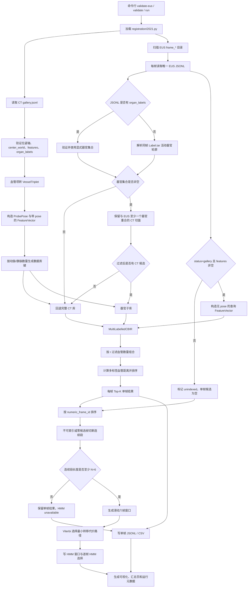
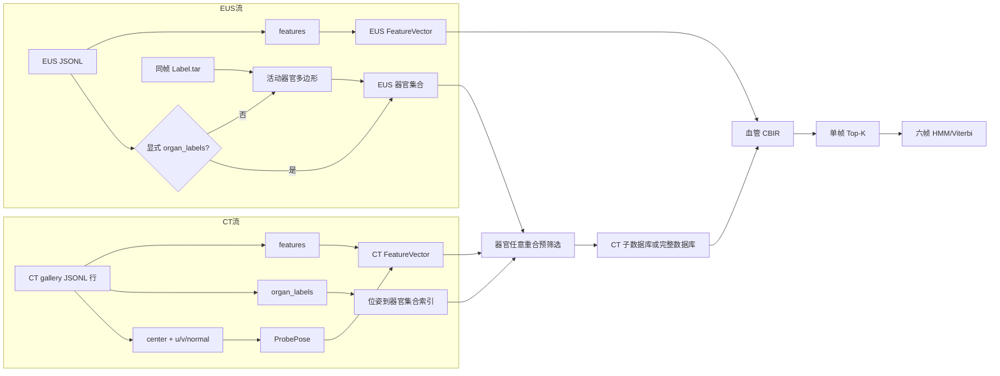
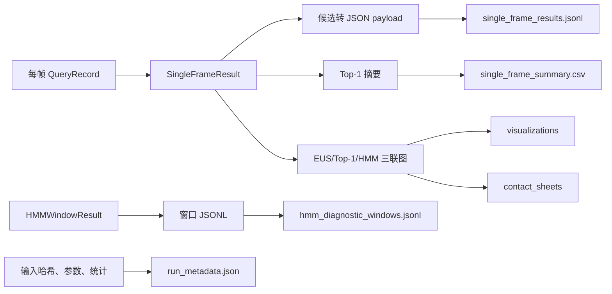

# Ramalhinho 2021 器官预筛选、血管 CBIR 与 HMM 项目完整说明

本文面向第一次接触本项目的读者，说明项目解决什么问题、数据如何进入程序、
为什么部分帧没有结果、单帧检索和 HMM 如何衔接，以及每个输出文件应该怎样
阅读。本文以代码提交 `27a9165f389dac6ad94ada901fc5f3673820ae3d` 和
2026-08-03 的正式运行结果为事实基线。

## 1. 结论先行

本项目使用已经建好的 CT 切面特征库，对每一帧 EUS 查询图像进行定位。流程
不是直接拿两张图片比较，而是先比较器官信息，再比较血管截面的二维位置和
面积，最后用 HMM 在连续多帧之间选择运动更平滑的 CT 位姿路径。

正式运行共处理 105 帧 EUS：

| 项目 | 数量 | 含义 |
|---|---:|---|
| CT 候选切面 | 112,749 | `gallery.jsonl` 中可检索的 CT 模拟超声切面 |
| EUS 总帧数 | 105 | 输入目录中检测到的查询帧 |
| 有血管特征、完成单帧检索 | 91 | 每帧都返回完整 Top-200 |
| 无血管特征、单帧无结果 | 14 | `status=unindexed` 且 `features=[]` |
| 实际应用器官预筛选 | 18 | 同时具有血管特征和非空活动器官轮廓 |
| 空器官集合、回退全 CT 库 | 73 | 仍然完成了血管检索，不会因此丢帧 |
| HMM 窗口 | 43 | 每个窗口包含 6 个可检索帧 |
| 获得 HMM 诊断结果的帧 | 88 | 至少属于一个完整六帧窗口 |
| 有单帧结果但没有 HMM 结果 | 3 | 所在连续有效段不足 6 帧 |

最重要的事实是：**器官过滤没有造成任何有效 EUS 帧没有单帧结果。**91 个
具有血管特征的 EUS 帧全部得到 200 个候选。没有单帧结果的 14 帧在进入检索
前就已经没有血管三元组，因此无法计算论文中的血管 CBIR 距离。

## 2. 为什么有的帧没有结果

“没有结果”可能表示两件不同的事，必须分别判断。

### 2.1 没有单帧 Top-K 结果

以下 14 帧的输入记录均为 `status=unindexed`、`features=[]`：

| 帧号 | TAR 中解析到的器官 | 无结果的直接原因 |
|---|---|---|
| `frame_00003744` | 无 | 没有血管特征 |
| `frame_00005310` | gallbladder | 有器官，但没有血管特征 |
| `frame_00006055` | 无 | 没有血管特征 |
| `frame_00007952` | kidney_left、spleen | 有器官，但没有血管特征 |
| `frame_00009279` | adrenal_gland_left | 有器官，但没有血管特征 |
| `frame_00010420` | adrenal_gland_left | 有器官，但没有血管特征 |
| `frame_00010461` | adrenal_gland_left | 有器官，但没有血管特征 |
| `frame_00011477` | 无 | 没有血管特征 |
| `frame_00011698` | gallbladder | 有器官，但没有血管特征 |
| `frame_00016189` | 无 | 没有血管特征 |
| `frame_00018247` | 无 | 没有血管特征 |
| `frame_00023556` | gallbladder | 有器官，但没有血管特征 |
| `frame_00030029` | gallbladder | 有器官，但没有血管特征 |
| `frame_00032757` | 无 | 没有血管特征 |

代码在 `inputs.py::_query_feature_vector()` 中执行以下判断：只有
`status="gallery"` 且 `features` 非空时，才创建 EUS `FeatureVector`。否则
`feature_vector=None`。随后 `pipeline.py::run_single_frame_retrieval()` 将该帧
标记为 `retrieval_status="unindexed"`，候选列表为空，不调用 CBIR。

器官标签只能缩小 CT 范围，不能代替血管特征。即使一帧已经标出了胆囊、脾脏
或肾脏，只要没有动脉或静脉截面三元组，仍然无法计算本项目的血管距离。

### 2.2 有单帧 Top-200，但没有 HMM 结果

以下 3 帧均有 200 个单帧候选，但 `hmm_status` 为
`insufficient_contiguous_valid_frames`：

- `frame_00008833`
- `frame_00016375`
- `frame_00016596`

原因是默认 HMM 窗口大小 `N=6`。不可索引帧或零候选帧会切断连续序列；切断
后长度不足 6 的小段不能组成 HMM 窗口。`frame_00008833` 位于两个不可索引帧
之间，构成长度 1 的有效段；`frame_00016375` 和 `frame_00016596` 构成长度 2
的有效段。它们的单帧 Top-200 仍然有效，只是没有多帧平滑后的 HMM 选择。

### 2.3 如何在结果中判断是哪一种情况

查看 `single_frame_results.jsonl` 或 `single_frame_summary.csv`：

| 字段 | 值 | 解释 |
|---|---|---|
| `retrieval_status` | `retrieved` | 已完成单帧检索 |
| `retrieval_status` | `unindexed` | 没有可用血管特征，单帧无结果 |
| `candidate_count` | `200` | 当前正式运行返回完整 Top-200 |
| `candidate_count` | `0` | 当前帧未进入单帧检索 |
| `hmm_status` | `diagnostic_only` | 有 HMM 诊断结果 |
| `hmm_status` | `unindexed` | 单帧就不可索引，因此也没有 HMM |
| `hmm_status` | `insufficient_contiguous_valid_frames` | 有单帧结果，但连续段不足 6 帧 |

## 3. 项目目标与边界

### 3.1 项目要解决的问题

输入是一帧或一段没有追踪器位姿的二维 EUS。输出是 CT 检索库中与该 EUS
血管结构相似的模拟切面及其三维位姿。连续帧模式进一步从每帧 Top-K 中选择
一条运动更平滑的候选路径。

### 3.2 本项目做什么

1. 验证并加载 CT `gallery.jsonl`。
2. 加载 EUS 血管特征，必要时从同帧 Label.tar 解析活动器官轮廓。
3. 用器官集合预筛选 CT 候选。
4. 调用 `registration/2021.py` 的多标签血管 CBIR。
5. 对连续有效帧运行六帧 HMM/Viterbi。
6. 导出 JSONL、CSV、运行元数据和对比图。

### 3.3 本项目不做什么

- 不重新建立 CT 检索库。
- 不从原始 EUS 图像重新分割血管；它消费已经提取好的血管特征。
- 不把器官标签加入论文血管距离公式；器官只用于检索前筛选。
- 没有患者世界坐标真值时，不计算 TRE，也不声明临床定位成功率。
- HMM 结果是诊断性的 CT 候选路径，不是经过真值验证的真实探头轨迹。

## 4. 完整流程图



## 5. 数据流

项目有两条独立输入流，在单帧检索前汇合。



### 5.1 CT 数据对象转换

一条 CT JSONL 记录会转成三部分：

1. `features[]` 中每个血管截面转成 `VesselTriplet(x, y, area, label)`。
2. `u_axis_world`、`v_axis_world`、`normal_world` 组成 3×3 方向矩阵，并转换为
   `rx、ry、rz` 欧拉角；`center_world` 作为 `ProbePose.surface_point`。
3. `FeatureVector(triplets, pose)` 同时保存血管特征和该 CT 切面的三维位姿。

查询 EUS 的 `FeatureVector` 只有血管三元组，没有患者世界坐标 `pose`。检索返回
CT `FeatureVector.pose`，因此输出位姿来自 CT 候选，不是 EUS 自带的真实位姿。

### 5.2 位姿轴与欧拉角

- `u_axis_world`：超声切面平面内的一个方向轴。
- `v_axis_world`：切面平面内与 u 正交的另一个方向轴。
- `normal_world`：垂直于切面的法向轴。
- `center_world`：100×100 mm 模拟切面的中心点。
- `rx、ry、rz`：把标准坐标系旋转到上述 u/v/normal 朝向的一种欧拉角编码。

输入适配器要求三条轴有限、单位化、两两正交并构成右手坐标系。转换后还会
使用 `HMMPoseEstimator._rotation_matrix()` 重建方向矩阵，记录最大重建误差。

## 6. 输入说明

### 6.1 CT 检索库

正式输入为：

```text
<case>/gallery/gallery.jsonl
```

每行是一张 CT 模拟超声切面，关键字段如下：

| 字段 | 类型 | 用途 |
|---|---|---|
| `slice_id` | string | CT 切面的唯一名称 |
| `status` | string | 必须为 `gallery` |
| `organ` | string | 采样起点所属器官，仅展示，不参与过滤 |
| `organ_labels` | list[string] | 该切面实际包含的器官集合，用于预筛选 |
| `center_world` | 3 个数 | 切面中心的 CT 世界坐标 |
| `u_axis_world` | 3 个数 | 切面局部 u 轴 |
| `v_axis_world` | 3 个数 | 切面局部 v 轴 |
| `normal_world` | 3 个数 | 切面法向轴 |
| `features` | list[object] | 动脉、静脉截面特征 |
| `ct_overlay_png` | string | 结果可视化使用的相对路径 |

单个血管特征格式：

```json
{
  "label": "vein",
  "x_mm": 57.59,
  "y_mm": 36.13,
  "area_mm2": 96.14
}
```

`organ_labels` 必须排序、去重，且只能使用项目定义的 11 类：肝、胃、胰腺、
十二指肠、食管、胆囊、脾、左右肾、左右肾上腺。

### 6.2 EUS 特征目录

```text
<eus-root>/
├── frame_00000073/
│   ├── frame_00000073_cropped_gallery.jsonl
│   ├── frame_00000073_cropped_jpg_Label.tar
│   └── frame_00000073_cropped_overlay.png
├── frame_00000273/
└── ...
```

每个 `*_cropped_gallery.jsonl` 必须恰好包含一条记录。项目按 `frame_id` 末尾
数字升序排列，而不是按文件系统返回顺序排列。

若 JSONL 已经包含 `organ_labels`，项目直接使用该字段；否则读取同目录、同帧
命名的 Label.tar。显式 JSONL 的优先级高于 TAR。

### 6.3 Label.tar 器官解析

项目只读取 TAR 内唯一 JSON 的 `Polys[].Shapes[]`，并满足：

- `Actived=true`；
- 是直接器官标签，而不是血管、胆管、胰管或胰腺分区；
- 至少有 3 个有限坐标点；
- 多边形面积大于 0。

当前直接标签映射：

| TAR ID | 中文结构 | 项目标签 |
|---:|---|---|
| 14 | 肝脏 | `liver` |
| 15 | 胆囊 | `gallbladder` |
| 18 | 脾脏 | `spleen` |
| 19 | 胰腺 | `pancreas` |
| 22 | 左侧肾上腺 | `adrenal_gland_left` |
| 23 | 右侧肾上腺 | `adrenal_gland_right` |
| 24 | 左侧肾脏 | `kidney_left` |
| 25 | 右侧肾脏 | `kidney_right` |
| 41 | 十二指肠肠腔 | `duodenum` |

本项目不使用 `FrameLabelModel.FrameLabel`。因此“整帧有标签”和“实际画出了
活动器官轮廓”是不同口径，本项目采用后者。

### 6.4 可选时间戳

CSV 必须包含：

```csv
frame_id,timestamp_seconds
frame_00000073,0.000
frame_00000273,0.025
```

每个 HMM 窗口内的时间戳必须完整、有限、严格递增。未提供 CSV 时，窗口使用
`[0,1,2,3,4,5]`，只表示等单位间隔，不代表真实 40 Hz 或真实秒数。

## 7. 输入处理流程

### 7.1 加载 `2021.py`

`inputs.py::load_registration_module()` 动态加载指定脚本，并检查以下对象存在：

- `VesselTriplet`
- `FeatureVector`
- `ProbePose`
- `DatabaseGenerator`
- `MultiLabelledCBIR`
- `HMMPoseEstimator`

这样可以通过 `--registration-module` 替换脚本路径，同时保留接口验证。

### 7.2 CT 图库分组

`DatabaseGenerator._make_db_key()` 按各血管类别的数量生成键。例如：

```text
artery:1_vein:3
```

表示该 CT 切面包含 1 个动脉截面和 3 个静脉截面。正式图库 112,749 条记录
形成了 291 种血管数量键。

### 7.3 EUS 是否可检索

只有同时满足以下条件的帧才进入单帧 CBIR：

```text
record.status == "gallery" AND record.features 非空
```

不满足时，项目仍保留该帧的记录、器官信息和可视化位置，但不会虚构血管特征。

## 8. 器官预筛选

### 8.1 默认 overlap 模式

设 EUS 器官集合为 Q，某 CT 切面的器官集合为 G。默认保留条件为：

```text
Q ∩ G ≠ ∅
```

即“至少有一个器官重合”。例如 EUS 为 `kidney_left+spleen` 时，只包含左肾
或只包含脾脏的 CT 切面都可以进入血管 CBIR。这是用户指定的策略，与“CT 必须
包含 EUS 的全部器官”不同。

### 8.2 回退规则

| 情况 | 行为 | `fallback_reason` |
|---|---|---|
| EUS 器官集合为空 | 使用完整 CT 库 | `empty_query_organs` |
| EUS 器官非空但零 CT 重合 | 使用完整 CT 库 | `no_organ_overlap` |
| `--organ-filter-mode off` | 主动关闭器官过滤 | `disabled` |
| 过滤成功 | 使用器官子库 | `null` |

因此空器官信息不会自动导致无结果。正式运行中的 73 个空器官、可检索帧全部
回退全库并返回 Top-200。

### 8.3 子库缓存

具有相同器官组合的 EUS 帧复用同一个 CT 子库和 CBIR 对象，避免每帧重复扫描
112,749 条记录。子库保持原图库顺序，同一 CT 位姿不会重复加入。

## 9. 单帧血管 CBIR

CBIR 是 Content-Based Image Retrieval，即基于内容的图像检索。本项目的
“内容”不是灰度像素，而是每个血管截面的类别、二维质心和面积。

### 9.1 搜索范围 r

正式参数 `r=2`。当前 `2021.py` 对 EUS 中出现的每个血管类别分别检查：

```text
abs(EUS 中该类数量 - CT 中该类数量) <= r
```

例如 EUS 有 2 个静脉截面，则 CT 静脉数量 0 至 4 都可能进入距离计算。当前实现
是“每个类别各自允许差不超过 2”，不是把所有类别数量差求和后再与 2 比较。

### 9.2 距离计算

对每个血管类别分别执行：

1. 比较 EUS 与 CT 中该类血管截面的数量，区分较小集合与较大集合。
2. 对较小集合中的每个截面，在较大集合中寻找二维质心最近的截面。
3. 累加质心距离平方和面积差平方。
4. 使用未匹配血管的面积关系形成面积惩罚。
5. 汇总各类别距离并按血管数量归一化。

距离越小表示血管截面结构越相似。程序按距离升序排列并取前 `K=200`。

### 9.3 单帧结果的含义

Top-1 是血管距离最小的候选，不等于有真值证明的正确位置。Top-K 保留多个
可能位置，供 HMM 利用帧间运动连续性继续选择。

## 10. HMM 与 Viterbi

### 10.1 隐状态与观测

- 观测：按时间排列的 EUS 帧。
- 隐状态：每一帧 Top-K 中某个 CT 候选位姿。
- 路径：为窗口内每一帧各选择一个候选，组成 CT 位姿序列。

Viterbi 是动态规划算法。它不会暴力枚举 `K^N` 条路径，而是逐帧保留到每个
候选状态的最小累计代价和前驱，最后回溯出总代价最低的路径。

### 10.2 窗口构造

默认 `N=6`。可检索帧先按数值帧号排序，不可索引或零候选帧会切断序列。每个
长度至少 6 的连续有效段生成滑动窗口。尾部帧使用最后一个可用窗口进行归属。

### 10.3 转移代价

相邻候选之间考虑：

- 上一切面局部 x 方向的位移；
- 上一切面局部 y 方向的位移；
- 上一切面法向 z 方向的位移；
- 两个切面法向量之间的夹角；
- 可选前向运动约束；
- 帧间时间差 `dt`。

位移先从 CT 世界坐标转换到上一帧切面的局部坐标系，再使用高斯模型计算负
对数转移代价。代价越低，表示相邻候选越符合平滑扫查运动。

### 10.4 HMM 参数

| 参数 | 默认值 | 单位 | 含义 |
|---|---:|---|---|
| `sigma_x` | 0.6 | mm | 切面局部 x 方向位移容忍度 |
| `sigma_y` | 0.6 | mm | 切面局部 y 方向位移容忍度 |
| `sigma_z` | 3.0 | mm | 沿切面法向位移容忍度 |
| `sigma_theta` | 2.0 | degree | 相邻切面朝向变化容忍度 |

`sigma_z` 比 x/y 大 5 倍，表示模型允许探头更明显地沿切面法向向深处或浅处
扫动，而对切面内横向漂移要求更严格。sigma 越大，该方向同样大小的变化受到
的惩罚越小；sigma 越小，惩罚越大。

### 10.5 当前 HMM 的事实边界

当前 `2021.py` 的 Viterbi 主要由帧间转移代价决定。结果标记为
`diagnostic_only`，因为 EUS 没有患者世界坐标位姿或配准真值。不要把 HMM
输出解释为已经验证的真实三维轨迹。

## 11. 输出处理流程



## 12. 输出目录结构

```text
results/
├── single_frame_results.jsonl
├── single_frame_summary.csv
├── hmm_diagnostic_windows.jsonl
├── run_metadata.json
├── README.md
├── visualizations/
│   ├── frame_00000073.png
│   └── ...
└── contact_sheets/
    ├── page_001.png
    └── ...
```

### 12.1 `single_frame_results.jsonl`

每行对应一个 EUS 帧，包含：

- `frame_id`、`status`、`query_features`；
- `query_organ_labels`、`organ_label_source`；
- `single_frame.retrieval_status`；
- `single_frame.organ_filter`；
- `single_frame.top_k`；
- `hmm_status` 和该帧的 `hmm_diagnostic`。

每个 Top-K 候选包含排名、距离、`slice_id`、器官集合、血管特征、中心点、
u/v/normal 方向轴和图片相对路径。

### 12.2 `single_frame_summary.csv`

这是便于 Excel 查看的一行一帧摘要。它只保存 Top-1 和 HMM 选中项，不保存
完整 Top-200。判断无结果时优先看：

- `feature_count`
- `retrieval_status`
- `single_candidate_count`
- `hmm_status`
- `organ_filter_fallback_reason`

### 12.3 `hmm_diagnostic_windows.jsonl`

每行对应一个 HMM 窗口，包含 6 个帧号、6 个时间戳、6 个选中 CT 候选及
5 个相邻转移代价。

### 12.4 `run_metadata.json`

记录：

- 运行模式与时间；
- `2021.py`、CT gallery、EUS JSONL 和器官来源的 SHA-256；
- K、r、HMM sigma、窗口大小和时间戳模式；
- CT/EUS 数量、器官分布、过滤帧数、回退数和零候选数；
- 位姿方向矩阵重建误差；
- 诊断性结果的事实边界。

### 12.5 可视化

每帧三联图依次为：EUS 叠加图、单帧 Top-1 CT、HMM 选中 CT。无结果时会
出现 `No single-frame candidate` 或 `HMM: unavailable` 占位文字。占位图表示
对应数值结果不存在，不表示程序崩溃。

## 13. 关键文件和代码职责

| 文件 | 关键对象/函数 | 作用 |
|---|---|---|
| `run_reproduction.py` | `main()` | 脚本入口，将 `src` 加入 Python 路径 |
| `src/ramalhinho2021/__main__.py` | `main()` | 支持 `python -m ramalhinho2021` |
| `src/ramalhinho2021/cli.py` | `build_parser()`、`_run_command()` | 参数解析、流程编排、哈希和汇总统计 |
| `src/ramalhinho2021/inputs.py` | `load_gallery_database()` | CT 行转 FeatureVector/ProbePose |
| `src/ramalhinho2021/inputs.py` | `load_eus_queries()` | EUS 加载、排序、可索引判定 |
| `src/ramalhinho2021/organs.py` | `load_organ_labels_from_tar()` | TAR 活动器官多边形解析与校验 |
| `src/ramalhinho2021/pipeline.py` | `run_single_frame_retrieval()` | 器官预筛选和单帧 CBIR |
| `src/ramalhinho2021/pipeline.py` | `build_hmm_window_assignments()` | 连续段切分和六帧窗口分配 |
| `src/ramalhinho2021/pipeline.py` | `run_hmm_diagnostics()` | Viterbi、转移代价和逐帧归属 |
| `src/ramalhinho2021/outputs.py` | `write_result_bundle()` | JSONL、CSV、图片和元数据导出 |
| `registration/2021.py` | `VesselTriplet` | 单个血管截面的 x/y/面积/类别 |
| `registration/2021.py` | `FeatureVector` | 一张切面的多个血管三元组 |
| `registration/2021.py` | `ProbePose` | CT 候选切面的三维位置和朝向 |
| `registration/2021.py` | `MultiLabelledCBIR` | 多标签血管距离和 Top-K 检索 |
| `registration/2021.py` | `HMMPoseEstimator` | 转移代价和 Viterbi |
| `environment.yml` | Mamba 环境 | Python、NumPy、Pillow、Pytest |
| `tests/` | 29 项测试 | 输入、器官、检索、HMM、输出和 CLI 回归测试 |

## 14. 关键运行参数

| 命令行参数 | 正式值 | 作用 |
|---|---:|---|
| `--k` | 200 | 每帧保留的 CT 候选上限 |
| `--search-range` | 2 | 每个 EUS 血管类别允许的数量差 |
| `--organ-filter-mode` | `overlap` | 至少一个器官重合后再做血管检索 |
| `--hmm-window-size` | 6 | 每个 HMM 窗口的帧数 |
| `--sigma-x` | 0.6 | 局部 x 位移标准差 |
| `--sigma-y` | 0.6 | 局部 y 位移标准差 |
| `--sigma-z` | 3.0 | 局部法向位移标准差 |
| `--sigma-theta` | 2.0 | 法向夹角标准差 |
| `--timestamps-csv` | 未提供 | 正式运行使用等单位间隔 |
| `--registration-module` | `registration/2021.py` | 算法核心脚本路径 |

参数覆盖值都会写入 `run_metadata.json`。改变参数会改变结果，比较实验时必须
同时比较运行元数据，不能只比较图片。

## 15. 使用命令

### 15.1 创建环境

```bash
cd /home/zyt/ramalhinho_2021_local_reproduction
mamba env create -f environment.yml
mamba activate ramalhinho-2021-reproduction
```

### 15.2 只验证 EUS

```bash
python run_reproduction.py validate-eus \
  --eus-root '/path/to/EUS标注与特征'
```

### 15.3 联合验证 CT 与 EUS

```bash
python run_reproduction.py validate \
  --gallery-jsonl '/path/to/gallery/gallery.jsonl' \
  --eus-root '/path/to/EUS标注与特征'
```

### 15.4 正式运行

```bash
python run_reproduction.py run \
  --gallery-jsonl '/path/to/gallery/gallery.jsonl' \
  --eus-root '/path/to/EUS标注与特征' \
  --output-dir '/path/to/new-results'
```

输出目录必须不存在或为空，防止新旧结果混写。

### 15.5 关闭器官过滤做基线

```bash
python run_reproduction.py run \
  --gallery-jsonl '/path/to/gallery/gallery.jsonl' \
  --eus-root '/path/to/EUS标注与特征' \
  --organ-filter-mode off \
  --output-dir '/path/to/baseline-results'
```

## 16. 专业术语说明

| 术语 | 说明 |
|---|---|
| CT | 计算机断层扫描，本项目提供三维解剖空间和模拟切面 |
| EUS | 内镜超声，本项目的二维查询图像来源 |
| LUS | 腹腔镜超声；论文术语，本项目代码保留部分 LUS 命名 |
| Gallery | 已知 CT 候选切面组成的检索库 |
| Query | 一帧待定位 EUS 及其特征 |
| CBIR | 基于内容的图像检索，本项目内容是血管结构而非原始像素 |
| Multi-labelled | 血管截面带类别标签，例如 artery 和 vein |
| VesselTriplet | 一个血管截面的二维 x、y 质心和面积，加类别标签 |
| FeatureVector | 一张切面上全部 VesselTriplet 的集合 |
| ProbePose | CT 候选切面的三维中心、旋转和深度编码 |
| organ | CT 切面的采样来源器官，不代表切面实际看见的全部器官 |
| organ_labels | CT/EUS 切面实际包含的器官集合，用于预筛选 |
| Top-K | 距离最小的前 K 个候选；正式运行 K=200 |
| r / search range | 血管数量组合的允许差；正式运行 r=2 |
| HMM | 隐马尔可夫模型，用相邻状态转移约束多帧候选路径 |
| Viterbi | 求 HMM 最小累计代价路径的动态规划算法 |
| Hidden state | 某帧选择的 CT 候选位姿 |
| Transition cost | 从上一 CT 候选移动到下一候选的不平滑惩罚 |
| sigma | HMM 高斯运动模型的方向标准差/容忍尺度 |
| Euler angles | 用 rx、ry、rz 三个顺序旋转角编码三维朝向 |
| u/v/normal | 切面局部两个平面内轴和一个法向轴 |
| unindexed | 没有可用血管 FeatureVector，不能进行单帧检索 |
| fallback | 器官信息不足时回退完整 CT 库，不等于检索失败 |
| diagnostic_only | 结果可用于流程诊断，但没有真值支持临床准确性结论 |
| TRE | Target Registration Error，目标配准误差；当前无真值不计算 |
| SHA-256 | 输入和代码文件内容指纹，用于确认复现实验输入是否一致 |

## 17. 当前正式运行结果解读

### 17.1 器官预筛选实际覆盖

105 帧均从 TAR 活动器官轮廓解析器官；26 帧器官集合非空，其中只有 18 帧
同时拥有血管特征并进入检索。18 帧的过滤后 CT 数量如下：

| EUS 器官组合 | 帧数 | 任意重合后的 CT 候选数 |
|---|---:|---:|
| gallbladder | 11 | 22,804 |
| kidney_left | 4 | 15,152 |
| spleen | 2 | 11,070 |
| kidney_left+spleen | 1 | 20,043 |

程序化验收确认这 18 帧的全部 3,600 个 Top-200 候选都至少与 EUS 共享一个
器官。其余 73 个可检索帧因为器官集合为空而回退完整 112,749 条 CT 库。

### 17.2 单帧与 HMM 覆盖

- 91 个可检索帧全部返回 200 个候选，没有候选短缺。
- 14 个不可索引帧返回 0 个候选。
- 88 帧获得 HMM 诊断选择。
- 3 帧仅有单帧 Top-200，没有完整六帧上下文。
- 共生成 43 个 HMM 窗口、105 张逐帧可视化和 14 张接触表。

### 17.3 不能从这些数字得出的结论

候选数量完整、器官一致、HMM 路径有限，只能证明工程流程按定义运行。没有
EUS 到 CT 的真实配准位姿或对应标记点时，不能据此声称定位正确、精度提高或
达到论文成功率。

## 18. 常见问题与排错

| 现象 | 优先检查 | 处理方向 |
|---|---|---|
| `Single: none` | `retrieval_status`、`feature_count` | 检查上游血管标注与特征提取 |
| `HMM: unavailable` | `hmm_status` | 判断是 unindexed 还是连续有效帧不足 6 |
| 器官过滤未应用 | `fallback_reason` | 空器官会自动回退；检查 JSONL/TAR 器官轮廓 |
| 候选少于 K | `candidate_shortfall_frame_count` | 检查 r、器官子库规模和血管数量键 |
| 时间戳报错 | CSV 帧号和顺序 | 所有窗口帧必须有严格递增时间戳 |
| 输出目录报错 | 目录是否非空 | 使用新的空目录，禁止混写旧结果 |
| 位姿轴报错 | u/v/normal | 检查单位长度、正交性和右手坐标系 |
| 结果看似重复 | Top-K 距离与 slice_id | 对称或重复采样切面可能具有相同特征/距离 |

若目标只是让更多帧获得 HMM 结果，可以减小 `--hmm-window-size`，但这会偏离
默认六帧实验设置并减少时序约束。若目标是让 14 个不可索引帧获得单帧结果，
必须在上游补充真实血管轮廓并重新提取 `features`；不应伪造血管三元组。

## 19. 可复现性附录

### 19.1 环境

- Python 3.12
- NumPy ≥ 1.26
- Pillow ≥ 10
- Pytest ≥ 8
- 环境管理：Mamba

### 19.2 正式运行标识

| 项目 | 值 |
|---|---|
| Git 提交 | `27a9165f389dac6ad94ada901fc5f3673820ae3d` |
| 运行模式 | `organ_overlap_prefilter_then_vascular_cbir` |
| 时间戳模式 | `equal_unit_intervals` |
| CT gallery SHA-256 | `074553604d49afe468a6eeb52dd2f8b403350ef01c96d5484a15c2e283cc7151` |
| EUS JSONL SHA-256 | `e72c1fc1baad5ae2bc1901af3c35049e11766bb99013f3593e92d1b8bfdb31ec` |
| EUS 器官来源 SHA-256 | `69005b9c3998a83a61cb021a27a026fc3fab15f0f8be5098241387100bd037f3` |

完整参数、哈希和统计应以每次输出目录中的 `run_metadata.json` 为准。
